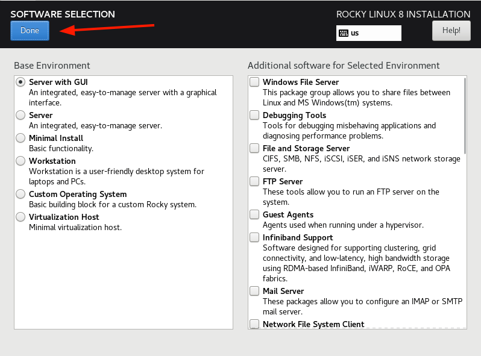

# Installing PLURA on Rocky Linux 8/9/10

## 🪟 SOFTWARE SELECTION > Server with GUI for KVM & Xrdp

## 🐧 Selinux mode is always on

    vi /etc/selinux/config
    
    SELINUX=enforcing

## 📝 Check list

### 🖥️ OS

- NAT gateway

### 📱 Install App

- kvm
- xrdp
- tigervnc
- remmina

---

## 🖥️ RHEL 9 vs RHEL 10 KVM 기능 비교

| 항목             | **RHEL 9**                          | **RHEL 10**                                                                    |
| -------------- | ----------------------------------- | ------------------------------------------------------------------------------ |
| **커널 버전**      | 5.14 기반 KVM                         | 6.12 기반 KVM (최신 가상화 확장 지원)                                                     |
| **지원 아키텍처**    | x86\_64, aarch64, IBM Power, IBM Z  | 동일 + 최신 CPU 플랫폼 지원 확대 (Intel Sapphire Rapids, AMD Genoa 등)                     |
| **CPU 가상화 기술** | Intel VT-x/VT-d, AMD-V, SEV, SEV-ES | Intel VT-x/VT-d, **Intel TDX** 지원, AMD SEV, **SEV-SNP** 강화                     |
| **메모리 보안**     | 기본 SEV/SEV-ES 지원                    | SEV-SNP(AMD) 및 TDX(Intel) 공식 지원, VM 메모리 암호화 향상                                 |
| **가상 펌웨어**     | OVMF(UEFI), Secure Boot 지원          | 동일 + 최신 UEFI 펌웨어 및 Secure Boot 정책 강화                                           |
| **스토리지 I/O**   | Virtio-blk, Virtio-scsi, vhost-scsi | Virtio-blk, Virtio-scsi, vhost-scsi 성능 최적화 및 다중큐(MQ) 개선                        |
| **네트워크 I/O**   | Virtio-net, vhost-net, SR-IOV       | Virtio-net 성능 향상, SR-IOV 최신 NIC 지원 확대                                          |
| **NUMA 최적화**   | 기본 NUMA 노드 인식 및 vCPU 핀닝 지원          | NUMA 자동 최적화, 향상된 스케줄러로 vCPU/메모리 배치 개선                                          |
| **관리 도구**      | `libvirt`, `virt-manager`, Cockpit  | `libvirt`, `virt-manager`, Cockpit + **OpenShift Virtualization(KubeVirt) 통합** |
| **보안 정책**      | SELinux 기반 KVM 격리                   | SELinux 정책 세분화, VM별 프로세스 격리 강화                                                 |
| **디스크 포맷**     | qcow2, raw, LVM 백엔드                 | 동일 + NVMe 기반 가상 디스크 최적화                                                        |
| **라이브 마이그레이션** | 기본 지원, 제한적 압축/암호화                   | 성능 향상된 라이브 마이그레이션, 암호화 채널 기본 활성화                                               |
| **GPU 가상화**    | 기본 PCI Passthrough, vGPU 일부 지원      | PCI Passthrough, 최신 NVIDIA vGPU & Intel GVT-g 지원 확대                            |
| **에코시스템**      | RHV(전통적 가상화 플랫폼) 지원                 | RHV 단계적 종료, **OpenShift + KubeVirt** 기반 전환 가속                                  |

---

💡 **핵심 변화 요약**

1. **보안** → RHEL 10은 VM 메모리 암호화(AMD SEV-SNP, Intel TDX)를 공식 지원하며, SELinux 격리 정책이 강화됨.
2. **성능** → 최신 커널 최적화, NUMA 자동화, Virtio 성능 향상.
3. **관리 방향** → 단독 호스트 가상화(RHV)에서 Kubernetes 통합 가상화(OpenShift Virtualization)로 전략 전환.

---

## 💾 Download

- http://mirror.navercorp.com/rocky/
- https://mirror.navercorp.com/rocky/8/isos/x86_64/
- https://mirror.navercorp.com/rocky/9/isos/x86_64/
- https://mirror.navercorp.com/rocky/10/isos/x86_64/

## 💾 Epel Download

- https://dl.fedoraproject.org/pub/epel/8/Everything/x86_64/Packages/
- https://dl.fedoraproject.org/pub/epel/9/Everything/x86_64/Packages/
- https://dl.fedoraproject.org/pub/epel/10/Everything/x86_64/Packages/

---

## ⏳ CentOS Stream EOL

- https://endoflife.date/centos-stream

---

| Release | Released              | Active Support                               | Security Support                              |
|---------|-----------------------|----------------------------------------------|-----------------------------------------------|
| **10**  | 8 months ago  (12 Dec 2024) | ✅ Ends in 4 years  (01 Jan 2030)              | ✅ Ends in 4 years  (01 Jan 2030)              |
| **9**   | 3 years and 11 months ago  (15 Sep 2021) | ✅ Ends in 1 year and 9 months  (31 May 2027) | ✅ Ends in 1 year and 9 months  (31 May 2027) |
| **8**   | 5 years and 11 months ago  (24 Sep 2019) | ❌ Ended 1 year and 2 months ago  (31 May 2024) | ❌ Ended 1 year and 2 months ago  (31 May 2024) |

---

## x. Useful Links

- https://gist.github.com/ihoneymon/652be052a0727ad59601
