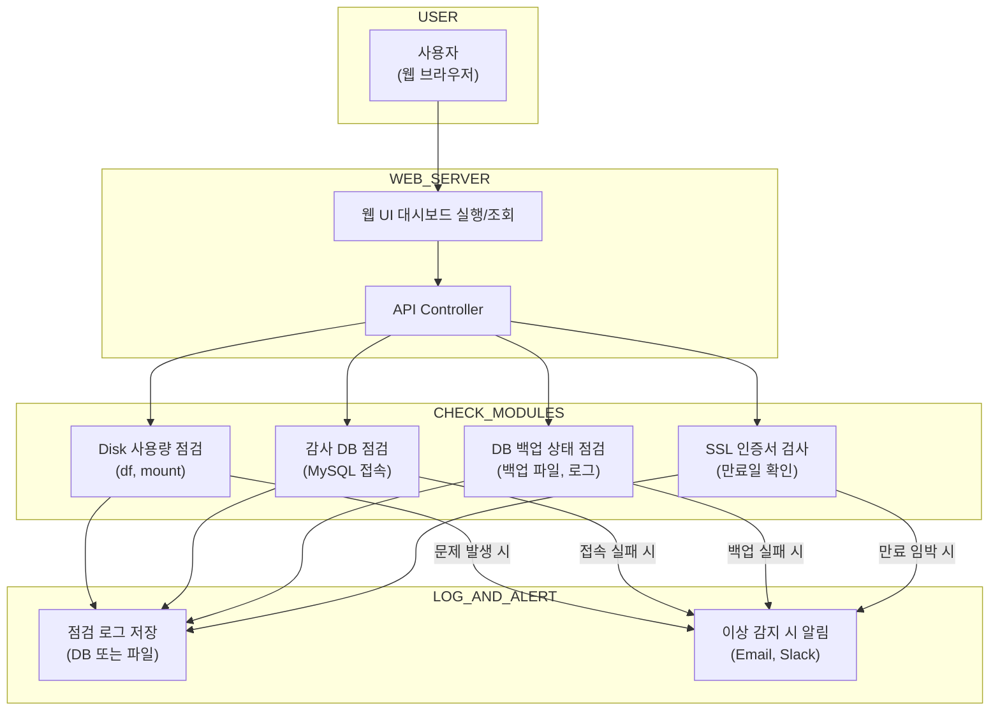

# 250-ansible
Ansible 을 이용하여 서버의 상태를 점검한다.

### 📘 시스템 점검 구성도

> 관리를 위하여 **웹 서비스를 통하여 각 항목별 수행/조회** 등을 수행하는 구성도입니다.


---

## 1. Disk 사용량 점검
- [ ] 70%, 80%와 같이 특정 사용량 이상을 점검합니다.
- [ ] check_disk_usage_?percent.log 파일에 저장됩니다.

```
# Usage: ./scripts/check_disk_usage.sh <THRESHOLD%> <ANSIBLE_GROUP> [--debug]

./check_disk_usage.sh 70% solr-weblog

cat check_disk_usage_70percent.log

./check_disk_usage.sh 70% solr-syslog

cat check_disk_usage_75percent.log
```

---
## 2. 감사 DB 사용 가능성 확인
- [ ] 중요 데이터, 설정 정보, 감사 기록 백업/복구

```
# Usage: ./scripts/mysql_insert_check.sh
```

---

## 3. 데이터베이스 백업
- [ ] 마스터 DB에 test_insert_table 테이블을 만들어 INSERT 테스트 수행
- [ ] INSERT 실패 또는 SELECT 확인 실패 시 문제로 간주
- [ ] 실패 시 메일로 알림 전송

```
# Usage: ./scripts/mysql_backup.sh
```
---

## 4. SSL/TLS 인증서 검사
- [ ] SSL 인증서의 만료일을 체크하고, 만료가 임박하면 경고 메일을 발송

```
# Usage: ./scripts/check_ssl_cert.sh
```

---
## 9. 시간 동기화 점검
- [ ] ntpdate
- [ ] chrony

```
# ./ntp/a_ntpdate.sh
# ./ntp/a_chrony.sh
```

---
