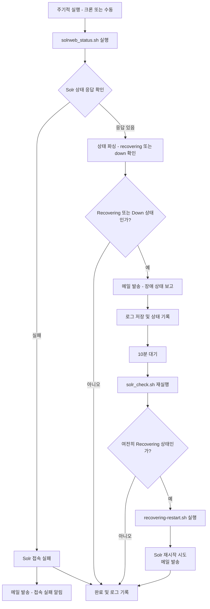

다음과 같은 흐름으로 **Ansible 플레이북 및 쉘 스크립트**로 자동화:

---

아래는 위에서 설명한 **Solr 상태 감시 및 자동 복구 프로세스 전체 흐름**을 시각화한 **Mermaid 다이어그램**입니다.

**`solrweb_status-061069.sh`의 메일 발송 기능도 포함**되어 있으며,
**Ansible 자동화 로직**과 **재시작 스크립트 실행 조건**도 반영하였습니다.

---

### 📊 Mermaid 플로우차트: Solr 상태 감시 및 자동 복구



---

### 📌 설명 요약

| 구간    | 동작                                          |
| ----- | ------------------------------------------- |
| `B~D` | Solr 상태 확인: 접속 실패인지, 상태 이상인지 확인             |
| `C1`  | 접속 불가 시 알림 메일 전송                            |
| `E1`  | 상태가 `recovering/down`일 경우 메일 전송             |
| `H~J` | 10분 대기 후 재확인                                |
| `K`   | 여전히 상태 이상이면 자동으로 `recovering-restart.sh` 실행 |
| `Z1`  | 정상 종료 또는 재시작 완료                             |

---

이 프로세스는 실시간 운영 모니터링뿐만 아니라 장애 자동 복구까지 모두 포함한 안정적인 구조입니다.
필요하시면 **Slack 연동**이나 **Grafana 상태 시각화**까지도 연동 가능하게 확장해 드릴 수 있습니다.


---

## ✅ 구조 요약

1. **`solr_check.sh`**

   * 상태 확인만 수행 (exit code로 `recovering` 감지)
2. **Ansible Playbook (`solr-recover-monitor.yml`)**

   * `solr_check.sh` 실행 → `recovering` 상태 감지
   * `pause` 10분
   * 다시 `solr_check.sh` 실행 → 여전히 `recovering`이면
   * `recovering-restart.sh` 실행

---

## 🧾 1. `solr_check.sh` (Ansible용 간소화 버전)

```bash
#!/bin/bash

SOLR_HOST=".61.69"
SOLR_PORT="8983"
SOLR_URL="http://$SOLR_HOST:$SOLR_PORT/solr/admin/collections?action=CLUSTERSTATUS"

response=$(curl -s --max-time 5 "$SOLR_URL")
if [ $? -ne 0 ] || [ -z "$response" ]; then
  echo "ERROR: Solr 접속 실패"
  exit 3
fi

  
recovering_count=$(echo "$response" | grep -o '"state":"recovering"' | wc -l)
if [ "$recovering_count" -gt 0 ]; then
  echo "DETECTED: $recovering_count core(s) recovering"
  exit 1
else
  echo "OK: No recovering cores"
  exit 0
fi
```

📌 이 스크립트는 Ansible에서 exit code로 제어하기 위해:

* `0`: 정상
* `1`: recovering 상태
* `3`: 접속 실패

---

## 🧾 2. Ansible Playbook (`solr-recover-monitor.yml`)

```yaml
---
- name: Monitor Solr recovering state and auto-restart
  hosts: solr_nodes
  become: true
  tasks:

    - name: Check Solr status for recovering
      shell: /home/sysadmin/solr_check.sh
      register: solr_check_result
      failed_when: false
      changed_when: false

    - name: Print initial check
      debug:
        msg: "{{ solr_check_result.stdout }}"

    - name: Wait 10 minutes if recovering detected
      pause:
        minutes: 10
      when: solr_check_result.rc == 1

    - name: Re-check Solr status after 10 minutes
      shell: /home/sysadmin/solr_check.sh
      register: solr_recheck_result
      when: solr_check_result.rc == 1
      failed_when: false
      changed_when: false

    - name: Print second check
      debug:
        msg: "{{ solr_recheck_result.stdout }}"
      when: solr_check_result.rc == 1

    - name: Run recovering-restart.sh if still recovering
      shell: /home/sysadmin/recovering-restart.sh
      when: solr_recheck_result.rc == 1
```

---

## 🗂️ 3. 인벤토리 예시 (`hosts`)

```ini
[solr_nodes]
061111-solr-web ansible_host=.61.111 ansible_user=sysadmin
```

---

## 🛠 실행 방법

```bash
ansible-playbook -i hosts solr-recover-monitor.yml
```

---

## 📌 주의 사항

| 항목    | 설명                                                        |
| ----- | --------------------------------------------------------- |
| 실행 권한 | `solr_check.sh`, `recovering-restart.sh` 모두 `chmod +x` 필요 |
| 경로    | `/home/sysadmin/`에 두 스크립트가 있어야 함                          |
| 크론 연동 | 필요 시 `cron`으로 `ansible-playbook` 주기 실행 가능                 |

---

## ⏱ 예: 15분마다 상태 감시 크론 등록

```bash
*/15 * * * * /usr/bin/ansible-playbook -i /home/sysadmin/hosts /home/sysadmin/solr-recover-monitor.yml >> /home/sysadmin/solr-monitor.log 2>&1
```

---
