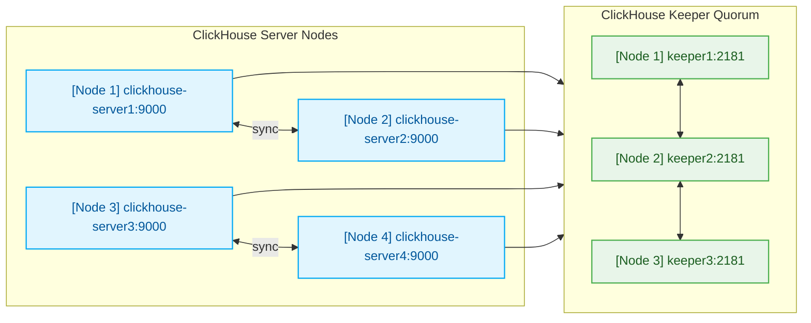

## 구성 1. clickhouse-server+keeper 3노드 / clickhouse-server 1노드 


## 0. 사전준비
### 0.1 hosts 등록
```
cat <<EOF | sudo tee -a /etc/hosts
xxx.xxx.xxx.1 node1-clickhouse
xxx.xxx.xxx.2 node2-clickhouse
xxx.xxx.xxx.3 node3-clickhouse
xxx.xxx.xxx.4 node4-clickhouse
EOF
```

### 0.2 방화벽 종료
```
방화벽 중지
systemctl stop firewalld
방화벽 비활성화
systemctl disable firewalld
```

### 0.3 THP 비활성화
```
sudo sh -c 'echo never > /sys/kernel/mm/transparent_hugepage/enabled'
sudo sh -c 'echo never > /sys/kernel/mm/transparent_hugepage/defrag'
```

### 0.4 커널 파라미터 적용 (Delay Accounting 및 최대 스레드 증대)
```
cat <<EOF | sudo tee -a /etc/sysctl.conf
kernel.task_delayacct = 1
kernel.threads-max = 2097152
vm.max_map_count = 1600000
EOF

sysctl 적용
sudo sysctl -p
```


## 1. 설치
### 1.1 레포지토리 설정 및 다운로드 설치
```
(프록시 구성 환경)
sudo dnf install -y yum-utils --setopt=proxy=http://xxx.xxx.xxx.xxx:3128
sudo yum-config-manager --add-repo https://packages.clickhouse.com/rpm/clickhouse.repo  --setopt=proxy=http://xxx.xxx.xxx.xxx:3128
sudo dnf install -y clickhouse-server clickhouse-client --setopt=proxy=http://xxx.xxx.xxx.xxx:3128
※ 프록시 예외 환경인 경우 --setopt=proxy=http://xxx.xxx.xxx.xxx:3128 제외
```

### 1.2 로그 설정
```
sudo vi /etc/clickhouse-server/config.d/system_logs.xml
<clickhouse>
    <keeper_server>
        <tcp_port>2181</tcp_port>
        <!-- 각 서버에 맞게 변경: 1번 노드는 1, 2번 노드는 2, 3번 노드는 3 -->
        <server_id>1</server_id>
        <log_storage_path>/var/lib/clickhouse/coordination/log</log_storage_path>
        <snapshot_storage_path>/var/lib/clickhouse/coordination/snapshots</snapshot_storage_path>

        <coordination_settings>
            <operation_timeout_ms>10000</operation_timeout_ms>
            <session_timeout_ms>30000</session_timeout_ms>
        </coordination_settings>

        <raft_configuration>
            <server>
                <id>1</id>
                <hostname>xxx.xxx.xxx.1</hostname>
                <port>9234</port>
            </server>
            <server>
                <id>2</id>
                <hostname>xxx.xxx.xxx.2</hostname>
                <port>9234</port>
            </server>
            <server>
                <id>3</id>
                <hostname>xxx.xxx.xxx.3</hostname>
                <port>9234</port>
            </server>
        </raft_configuration>
    </keeper_server>
</clickhouse>
```
### 1.3 매크로 설정(각 노드별 적용)
```
<clickhouse>
    <macros>
        <shard>01</shard>
        <replica>node1</replica>
	</macros>
</clickhouse>
2번 서버
<clickhouse>
    <macros>
        <shard>01</shard>
        <replica>node2</replica>
    </macros>
</clickhouse>
3번 서버
<clickhouse>
    <macros>
        <shard>02</shard>
        <replica>node3</replica>
    </macros>
</clickhouse>
4번 서버
<clickhouse>
    <macros>
        <shard>02</shard>
        <replica>node4</replica>
    </macros>
</clickhouse>
```

### 1.4 클러스터 및 keeper 설정 (4대 서버 공통)

```
<clickhouse>
    <!-- 외부 및 다른 서버 통신 허용 -->
    <listen_host>0.0.0.0</listen_host>

    <!-- 2개 샤드, 각 샤드별 2개 복제본 구성 -->
    <remote_servers>
        <stats_cluster>
            <!-- Shard 1 -->
            <shard>
                <internal_replication>true</internal_replication>
                <replica>
                    <host>xxx.xxx.xxx.1</host>
                    <port>9000</port>
                </replica>
                <replica>
                    <host>xxx.xxx.xxx.2</host>
                    <port>9000</port>
                </replica>
            </shard>
            <!-- Shard 2 -->
            <shard>
                <internal_replication>true</internal_replication>
                <replica>
                    <host>xxx.xxx.xxx.3</host>
                    <port>9000</port>
                </replica>
                <replica>
                    <host>xxx.xxx.xxx.4</host>
                    <port>9000</port>
                </replica>
            </shard>
        </stats_cluster>
    </remote_servers>

    <!-- Keeper 연결 설정 (모든 서버가 3대의 Keeper를 바라봄) -->
    <zookeeper>
        <node>
            <host>xxx.xxx.xxx.1</host>
            <port>2181</port>
        </node>
        <node>
            <host>xxx.xxx.xxx.2</host>
            <port>2181</port>
        </node>
        <node>
            <host>xxx.xxx.xxx.3</host>
            <port>2181</port>
        </node>
    </zookeeper>
</clickhouse>
```

### 1.5 LimitNPROC 및 LimitNOFILE 설정 추가
```
sudo mkdir -p /etc/systemd/system/clickhouse-server.service.d/

cat <<EOF | sudo tee /etc/systemd/system/clickhouse-server.service.d/override.conf
[Service]
LimitNPROC=500000
LimitNOFILE=500000
EOF
```

### 1.6 실행파일 생성
```
vi clickhouse-start.sh

# 1. THP 비활성화
sudo sh -c 'echo never > /sys/kernel/mm/transparent_hugepage/enabled'
sudo sh -c 'echo never > /sys/kernel/mm/transparent_hugepage/defrag'

# 2. 커널 파라미터 적용 (Delay Accounting 및 최대 스레드 증대)
cat <<EOF | sudo tee -a /etc/sysctl.conf
kernel.task_delayacct = 1
kernel.threads-max = 2097152
vm.max_map_count = 1600000
EOF

# 3. sysctl 적용 및 ClickHouse 서비스 재시작
sudo sysctl -p
sudo systemctl restart clickhouse-server
```
