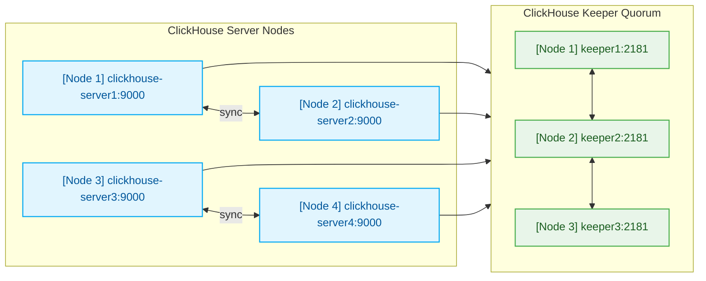
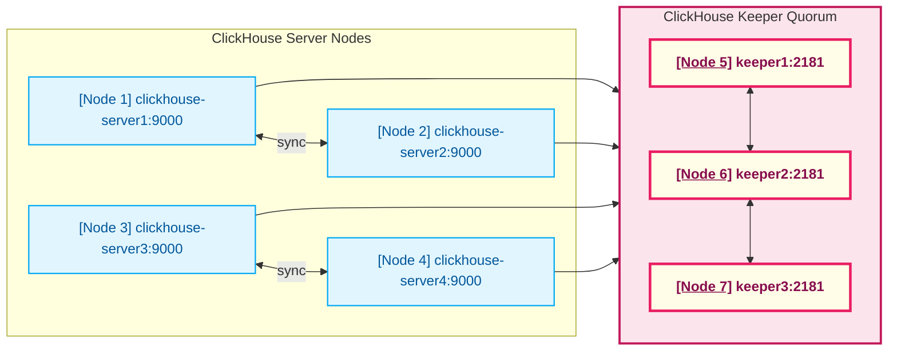

## 구성 방법
### 구성 1. clickhouse-server+keeper 3노드 / clickhouse-server 1노드 

```mermaid
graph LR
    %% ----------------------------------------------------
    %% [구조 핵심] 서버 레이어와 키퍼 레이어를 가로축으로 분리하여 
    %% 배치 엔진이 꼬이는 현상을 근본적으로 차단합니다.
    %% ----------------------------------------------------
    
    %% 스타일 정의
    classDef serverStyle fill:#E1F5FE,stroke:#03A9F4,stroke-width:1.5px,color:#01579B;
    classDef keeperStyle fill:#E8F5E9,stroke:#4CAF50,stroke-width:1.5px,color:#1B5E20;

    %% 1. ClickHouse Servers (좌측 정렬)
    subgraph ClickHouse_Cluster [ClickHouse Server Nodes]
        direction TB
        S1["[Node 1] clickhouse-server1:9000"]:::serverStyle
        S2["[Node 2] clickhouse-server2:9000"]:::serverStyle
        S3["[Node 3] clickhouse-server3:9000"]:::serverStyle
        S4["[Node 4] clickhouse-server4:9000"]:::serverStyle
        %%S1 <--sync--> S2
        %%S3 <--sync--> S4
    end

    %% 2. Keeper Quorum (우측 정렬)
    subgraph Keeper_Cluster [ClickHouse Keeper Quorum]
        direction TB
        K1["[Node 1] keeper1:2181"]:::keeperStyle
        K2["[Node 2] keeper2:2181"]:::keeperStyle
        K3["[Node 3] keeper3:2181"]:::keeperStyle
    end


    %% 3. Keeper 간의 상호 동기화 지시선 (우측에서 자기들끼리 순환)
    K1 <--> K2 <--> K3

    %% 4. 모든 Server에서 모든 Keeper로 가는 지시선 정렬
    %% (로컬 통신은 실선, 원격 교차 통신은 점선으로 렌더링을 맑게 처리)
    S1 --> Keeper_Cluster
    S2 --> Keeper_Cluster
    S3 --> Keeper_Cluster
    S4 --> Keeper_Cluster

        S1 <--sync--> S2
        S3 <--sync--> S4


```
### 구성2. clickhouse-server 4노드 / keeper 3노드

```mermaid
graph LR
    %% ----------------------------------------------------
    %% [구조 핵심] 서버 레이어와 키퍼 레이어를 가로축으로 분리하여 
    %% 배치 엔진이 꼬이는 현상을 근본적으로 차단합니다.
    %% ----------------------------------------------------
    
    %% 스타일 정의
    classDef serverStyle fill:#E1F5FE,stroke:#03A9F4,stroke-width:1.5px,color:#01579B;
    
    %% 핫핑크/진보라 테두리와 노란색 배경으로 키퍼 스타일 구성
    classDef keeperStyle fill:#FFFDE7,stroke:#E91E63,stroke-width:3px,color:#880E4F,font-weight:bold;

    %% 1. ClickHouse Servers (좌측 정렬 - 파란색 레이어)
    subgraph ClickHouse_Cluster [ClickHouse Server Nodes]
        direction TB
        S1["[Node 1] clickhouse-server1:9000"]:::serverStyle
        S2["[Node 2] clickhouse-server2:9000"]:::serverStyle
        S3["[Node 3] clickhouse-server3:9000"]:::serverStyle
        S4["[Node 4] clickhouse-server4:9000"]:::serverStyle
    end

    %% 2. Keeper Quorum (우측 정렬 - 핑크 레이어 및 밑줄 유지)
    subgraph Keeper_Cluster [ClickHouse Keeper Quorum]
        direction TB
        K1["<b><u>[Node 5]</u></b> keeper1:2181"]:::keeperStyle
        K2["<b><u>[Node 6]</u></b> keeper2:2181"]:::keeperStyle
        K3["<b><u>[Node 7]</u></b> keeper3:2181"]:::keeperStyle
    end

    %% Keeper 서브그래프 박스 자체를 연한 핑크 배경과 붉은색 실선 테두리로 강조
    style Keeper_Cluster fill:#FCE4EC,stroke:#C2185B,stroke-width:2.5px;

    %% 3. Keeper 간의 상호 동기화 지시선
    K1 <--> K2 <--> K3

    %% 4. 모든 Server에서 Keeper Cluster 전체로 가는 지시선
    S1 --> Keeper_Cluster
    S2 --> Keeper_Cluster
    S3 --> Keeper_Cluster
    S4 --> Keeper_Cluster

    %% 서버 간 싱크 라인
    S1 <-- sync --> S2
    S3 <-- sync --> S4


```
