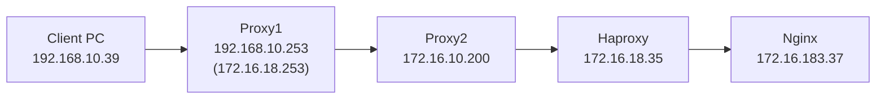

# HAProxy 3.2.20 X-Forwarded-For 설정 테스트 정리


---

## 1. 접속 테스트 구성


```
Client PC -> Proxy1 -> Proxy2 -> Haproxy -> Nginx
접속 테스트는 http 프로토콜(https 테스트 불가)

1. Client PC 는 브라우저 or curl를 사용하여 Proxy1를 통해 Web 접속
2  Proxy1 은
   1) 자신(Proxy1)xff 를 생성, Haproxy 접속
   2) Proxy2 경유 자신(Proxy2) XFF 추가 생성, haproxy 접속 (추가 경유 테스트 목적)
3. haproxy 는 xff 를 재구성하여 nginx 접속
4. Nginx access 로그 확인
```

---
## 2. 사전 설정
Proxy(Squid) xff 설정
```
request_header_access X-Forwarded-For allow all
forwarded_for on
```


## 3. haproxy X-Forwarded-For 설정 별 테스트 및 결과
### 3.1 req.hdr
#### 3.1.1 req.hdr 설정 구문
```
http-request set-header X-Forwarded-For %[src],%[req.hdr(X-Forwarded-For)] if { req.hdr(X-Forwarded-For) -m found }
```

#### 3.1.2 테스트 및 웹 로그 결과
```
브라우저
172.16.18.35 - - [01/Jul/2026:09:44:30 +0900] "GET / HTTP/1.1" 200 7620 "-" "Mozilla/5.0 (Windows NT 10.0; Win64; x64) AppleWebKit/537.36 (KHTML, like Gecko) Chrome/122.0.0.0 Safari/537.36 Edg/122.0.0.0" "172.16.10.200,172.16.18.253"
```
```
curl-pattern-1
curl -k -x "http://proxy" -H "X-Forwarded-For: 1.1.1.1"  http://domain/
172.16.18.35 - - [01/Jul/2026:10:17:18 +0900] "GET / HTTP/1.1" 200 3332 "-" "curl/8.19.0" "172.16.10.200,172.16.18.253"
```
```
curl-pattern-2
curl -k -x "http://proxy" -H "X-Forwarded-For: 1.1.1.1.,2.2.2.2" http://domain/
172.16.18.35 - - [01/Jul/2026:10:18:26 +0900] "GET / HTTP/1.1" 200 3332 "-" "curl/8.19.0" "172.16.10.200,172.16.18.253"
```
```
curl-pattern-3
curl -k -x "http://proxy" -H "X-Forwarded-For: 1.1.1.1" -H "X-Forwarded-For: 3.3.3.3"  http://domain
172.16.18.35 - - [01/Jul/2026:10:19:11 +0900] "GET / HTTP/1.1" 200 3332 "-" "curl/8.19.0" "172.16.10.200,172.16.18.253"
```
#### 3.1.3 결과
```
xff 필드 좌측 데이터는 haproxy 확인 src 주소
그 뒤로 경유 과정의 src 앞단 주소 확인
즉 src 이전의 하나의 주소만 확인 가능(경유가 없다면, curl 헤더 임의 지정 xff 필드 단일 주소 확인)
```
---

### 3.2 req.fhdr
#### 3.2.1 req.fhdr 설정 구문
```
http-request set-header X-Forwarded-For %[src],%[req.fhdr(X-Forwarded-For)] if { req.fhdr(X-Forwarded-For) -m found }
```
#### 3.2.2 테스트 및 웹 로그 결과
```
브라우저
172.16.18.35 - - [01/Jul/2026:10:22:52 +0900] "GET /favicon.ico HTTP/1.1" 200 3332 "http://haproxy.plura.io/" "Mozilla/5.0 (Windows NT 10.0; Win64; x64) AppleWebKit/537.36 (KHTML, like Gecko) Chrome/122.0.0.0 Safari/537.36 Edg/122.0.0.0" "172.16.10.200,192.168.10.39, 172.16.18.253"
```
```
curl-pattern-1
curl -k -x "http://proxy" -H "X-Forwarded-For: 1.1.1.1"  http://domain/
172.16.18.35 - - [01/Jul/2026:10:23:47 +0900] "GET / HTTP/1.1" 200 3332 "-" "curl/8.19.0" "172.16.10.200,1.1.1.1, 192.168.10.39, 172.16.18.253"
```
```
curl-pattern-2
curl -k -x "http://proxy" -H "X-Forwarded-For: 1.1.1.1.,2.2.2.2" http://domain/
172.16.18.35 - - [01/Jul/2026:10:23:41 +0900] "GET / HTTP/1.1" 200 3332 "-" "curl/8.19.0" "172.16.10.200,1.1.1.1,2.2.2.2, 192.168.10.39, 172.16.18.253"
```
```
curl-pattern-3
curl -k -x "http://proxy" -H "X-Forwarded-For: 1.1.1.1" -H "X-Forwarded-For: 3.3.3.3"  http://domain
172.16.18.35 - - [01/Jul/2026:10:29:37 +0900] "GET / HTTP/1.1" 200 3332 "-" "curl/8.19.0" "172.16.10.200,1.1.1.1, 3.3.3.3, 192.168.10.39, 172.16.18.253"
```
#### 3.2.3 결과
```
xff 필드 좌측 데이터는 haproxy 확인 src 주소
그 뒤로 헤더 임의 지정 xff 데이터, Client, 경유 IP 순 확인
모든 IP주소 확인 가능
```
---

### 3.3 req.allhdr
### 3.3.1 req.allhdr 설정 구문

```
출현
client -> haproxy -> nginx (squid가 없는 구조) 일때,
client가 아래 패턴와  curl-pattern-3 형식 실행 시, 임의 지정된 xff 정보를 로그에 생성못하는 것을 확인.
```

### 3.3.2 테스트 및 웹 로그 결과
```
curl-pattern-3 (curl -k -x "http://proxy" -H "X-Forwarded-For: 1.1.1.1" -H "X-Forwarded-For: 3.3.3.3"  http://domain)
172.16.18.35 - - [01/Jul/2026:10:36:34 +0900] "GET / HTTP/1.1" 200 7620 "-" "curl/8.6.0" "172.16.30.250,3.3.3.3"
```
### 3.3.3 결과
```
xff 필드 좌측 데이터는 haproxy 확인 src 주소
그 뒤로 헤더 임의 지정 xff 데이터
curl 임의 지정된 xff 헤더에서 마지막에 입력된 xff 헤더 데이터만 확인.

이를 해결하기 위해 모든 request 데이터를 확인하는 fetch 함수 생성 필요.
haproxy에서 자체 제공하는 함수는 없음. http_fetch.c 소스에서 관련 코드를 구현하여 재빌드 필요.
재빌드 후 아래와 같이 설정
http-request set-var(txn.xff) req.allhdr(X-Forwarded-For)
http-request set-header X-Forwarded-For %[src],%[var(txn.xff)]
```
- [allhdr 재빌드 방법](https://github.com/QubitSecurity/howto/blob/main/rocky9/app/haproxy/allhdr.md)
---


