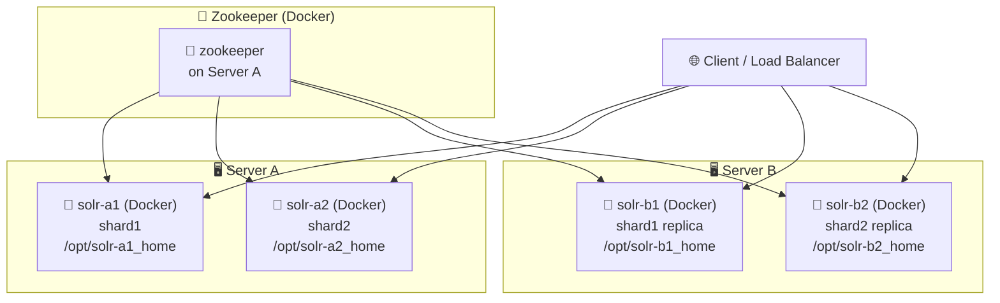

아래는 **Docker 기반 SolrCloud 최소 클러스터 구성 설명서**입니다.
**Persistent Volume 사용**, **물리 서버-컨테이너 관계**, **Mermaid 구조도**입니다.

---

# 🐳 Docker 기반 SolrCloud 최소 클러스터 구성 문서

Apache SolrCloud를 Docker 기반으로 테스트하거나 개발용으로 구성할 경우, 다음과 같은 **최소 구성 클러스터**로 시작하는 것이 유용합니다.

이 문서에서는 다음과 같은 핵심 사항을 다룹니다:

* SolrCloud 기본 구조 (shard + replica)
* Docker 컨테이너 배포 모델
* **Persistent Volume**을 통한 데이터 보존
* 시각적 구조도 (Mermaid)

---

## 📊 클러스터 아키텍처 개요

* Zookeeper 1개 (단일 노드, 테스트용)
* Solr 인스턴스 4개 (shard 2개 + 각 replica 1개)
* 물리 서버 2대: Server A, Server B
* 모든 Solr 컨테이너는 **Docker 기반으로 배포**
* 각 컨테이너는 독립적인 **Persistent Volume**을 마운트하여 데이터 보존

---

## 🖼 Mermaid 구성도



---

## 📦 구성 요약

| 항목                       | 내용                          |
| ------------------------ | --------------------------- |
| 🧭 Zookeeper             | 단일 노드 컨테이너 (Server A에 위치)   |
| 🧱 Solr 컨테이너             | 총 4개 (서버당 2개씩), Cloud 모드 실행 |
| 🖥 물리 서버 수               | 2대 (Server A, Server B)     |
| 🧠 데이터 구조                | shard 2개 + 각 replica 1개     |
| 🔄 네트워크                  | Docker bridge 또는 overlay    |
| 📌 **Persistent Volume** | 컨테이너마다 독립된 host 디스크 마운트 필수  |

---

## 🧱 실제 컨테이너 구성 예시

| 컨테이너 이름   | 서버 | 역할             | 포트 매핑     | Persistent Volume 경로 |
| --------- | -- | -------------- | --------- | -------------------- |
| zookeeper | A  | 클러스터 메타 관리     | 2181:2181 | `/opt/zk-data`       |
| solr-a1   | A  | shard1         | 8983:8983 | `/opt/solr-a1_home`  |
| solr-a2   | A  | shard2         | 8984:8983 | `/opt/solr-a2_home`  |
| solr-b1   | B  | shard1 replica | 8983:8983 | `/opt/solr-b1_home`  |
| solr-b2   | B  | shard2 replica | 8984:8983 | `/opt/solr-b2_home`  |

---

## 💾 Persistent Volume이 필요한 이유

Docker 컨테이너는 기본적으로 휘발성이며, **재시작 시 모든 데이터가 유실**됩니다.
Solr는 다음 데이터를 디스크에 저장합니다:

* 색인된 문서 (index)
* Core 설정
* Schema 및 Collection 정보
* 트랜잭션 로그 및 운영 로그

따라서 반드시 **호스트 디스크를 마운트하여 영구 스토리지를 구성**해야 합니다.

### 마운트 예시 (`docker run` 명령)

```bash
docker run -d \
  --name solr-a1 \
  -p 8983:8983 \
  -v /opt/solr-a1_home:/var/solr \
  solr:8.11 \
  solr start -c -z zookeeper:2181
```

---

## 📁 디렉토리 구조 예시

```bash
/opt/
├── solr-a1_home/
│   ├── data/
│   ├── logs/
│   └── core1/
├── solr-a2_home/
├── solr-b1_home/
├── solr-b2_home/
├── zk-data/
```

---

## ✅ 결론

* 이 구조는 **SolrCloud의 최소 동작 모델을 Docker 기반으로 재현**한 예시입니다.
* 각 컨테이너는 반드시 **Persistent Volume**을 통해 데이터 손실을 방지해야 하며,
* 클러스터 확장 시에도 동일한 구조를 따라 수평 확장이 가능합니다.

---

## 📌 다음 단계

이 구성을 기반으로:

* `docker-compose.yml` 자동 배포 템플릿
* SolrCloud 컬렉션 생성 스크립트
* Zookeeper 3노드 고가용성 구성
* Prometheus 기반 모니터링 연동

등을 확장 적용할 수 있습니다. 
