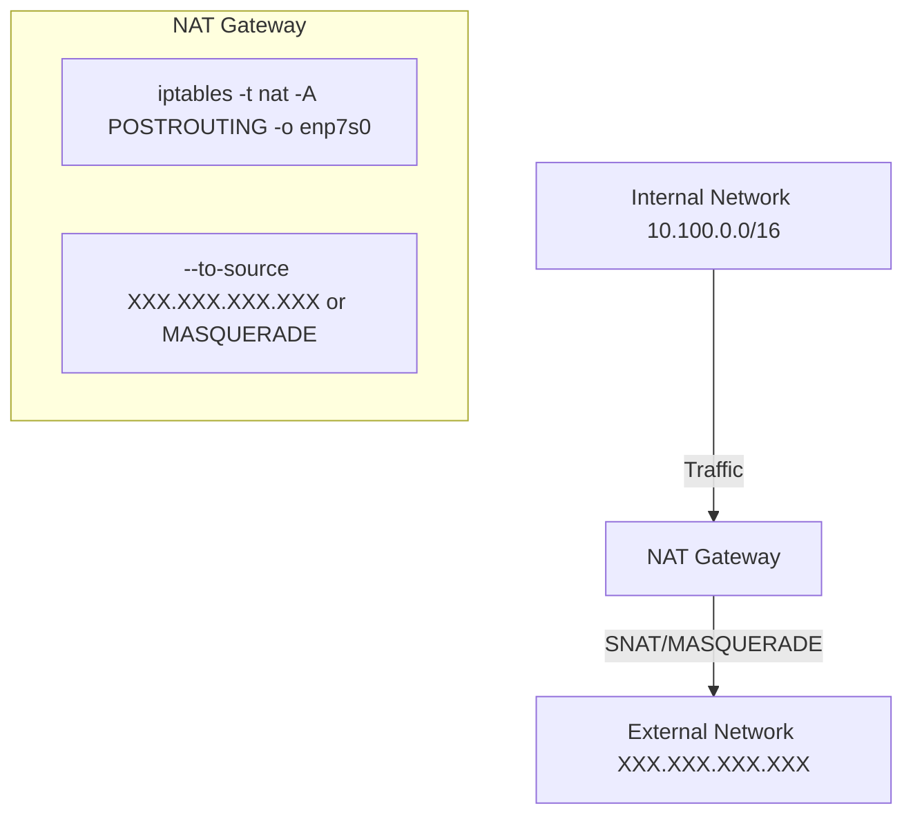

### NAT Gateway 서버 구축 가이드

## 0. 사전 작업

### 0.1 IPv4 패킷 포워딩 허용
IPv4 패킷 포워딩을 활성화합니다. 이 작업은 NAT 동작을 위해 필수적입니다.

#### 1. 일시적으로 허용
```
sysctl -w net.ipv4.ip_forward=1
sysctl -p
```

#### 2. 영구적으로 허용
```
vi /etc/sysctl.conf
```
파일에서 다음 라인을 추가합니다:
```
net.ipv4.ip_forward = 1
```
변경 사항 적용:
```
sysctl -p
```

## 1. iptables 설정

### 1.1 iptables NAT 규칙 설정
서버의 네트워크 트래픽을 NAT (Network Address Translation)로 변환하기 위해 iptables 규칙을 설정합니다.

#### 1.1.1 SNAT 설정
특정 내부 네트워크(예: 10.100.0.0/16)를 외부 네트워크로 NAT 변환:
```
iptables -t nat -A POSTROUTING -o enp7s0 -s 10.100.0.0/16 -j SNAT --to-source XXX.XXX.XXX.XXX
```
- **옵션 설명**:
  - `iptables`: 명령어
  - `-t nat`: NAT 테이블을 사용
  - `-A POSTROUTING`: NAT 변환 후 트래픽을 처리하는 POSTROUTING 체인에 규칙 추가
  - `-o enp7s0`: 네트워크 인터페이스(예: `enp7s0`)를 통한 트래픽
  - `-s 10.100.0.0/16`: 내부 네트워크 범위
  - `-j SNAT`: Source NAT 규칙 적용
  - `--to-source XXX.XXX.XXX.XXX`: NAT 변환 후 사용할 외부 IP 주소

#### 1.1.2 MASQUERADE 설정
인터페이스가 동적으로 IP를 받는 경우, MASQUERADE 설정 사용:
```
iptables -t nat -A POSTROUTING -o enp7s0 -j MASQUERADE
```

### 1.2 iptables 서비스 설치
```
dnf install iptables-services
```

### 1.3 iptables 규칙 저장
시스템 재부팅 후에도 규칙을 유지하려면 아래 명령으로 규칙을 저장합니다:
```
service iptables save
```

## 2. 기타 iptables 명령어

### 2.1 현재 룰 확인
```
iptables -t nat -L -n -v
```

### 2.2 특정 룰 삭제
1. 룰 번호 확인:
```
iptables -t nat -L POSTROUTING -n -v --line-numbers
```
2. 룰 삭제:
```
iptables -t nat -D POSTROUTING <번호>
```

---

### NAT Gateway 동작 구성도 (Mermaid)



이 구성도는 내부 네트워크의 트래픽이 NAT Gateway를 통해 외부 네트워크로 전달되는 과정과, iptables 규칙을 통한 NAT 처리 방식을 시각화한 것입니다.
