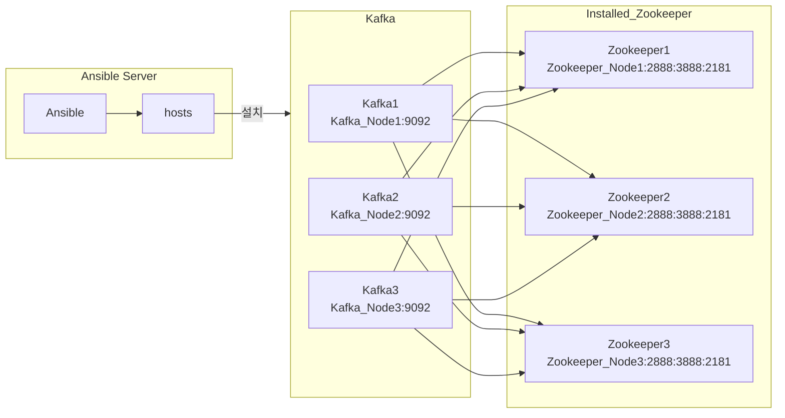

### 0. 설치 환경
```
ansible hosts 파일 경로 : /home/qubit/ansible/hosts
kafka 실행 경로 : /opt/kafka
cmak 실행 경로 : /opt/cmak
akhq 실행 경로 : /opt/akhq

파일 종류
kafka.yml - ansible을 통해 kafka 를 다운로드, 설치, 실행하는 yml
server.propertise.j2 - kafka 실행 설정 파일 생성을 위한 jinja2 파일
cmak.yml - ansible을 통해 cmak, akhq 를 다운로드, 설치, 실행하는 yml
application.conf.j2 - cmak 실행 설정 파일 생성을 위한 jinja2 파일
```

### 1. 설치 방법
```
ansible-playbook -i /home/qubit/ansible/hosts /home/qubit/ansible/kafka.yml
ansible-playbook -i /home/qubit/ansible/hosts /home/qubit/ansible/cmak.yml
```

### 2. 서비스 전체 종료
```
ansible -i /home/qubit/ansible/hosts zk -m command -a "sudo systemctl stop kafka"
ansible -i /home/qubit/ansible/hosts zk -m command -a "sudo systemctl stop cmak"
ansible -i /home/qubit/ansible/hosts zk -m command -a "sudo systemctl stop akhq"
```

### 3. 서비스 전체 설치 파일 삭제
```
ansible -i /home/qubit/ansible/hosts zk -m shell -a "sudo rm -rf /opt/kafka"
ansible -i /home/qubit/ansible/hosts zk -m shell -a "sudo rm -rf /opt/cmak"
ansible -i /home/qubit/ansible/hosts zk -m shell -a "sudo rm -rf /opt/akhq"
```
### 4. 구조

