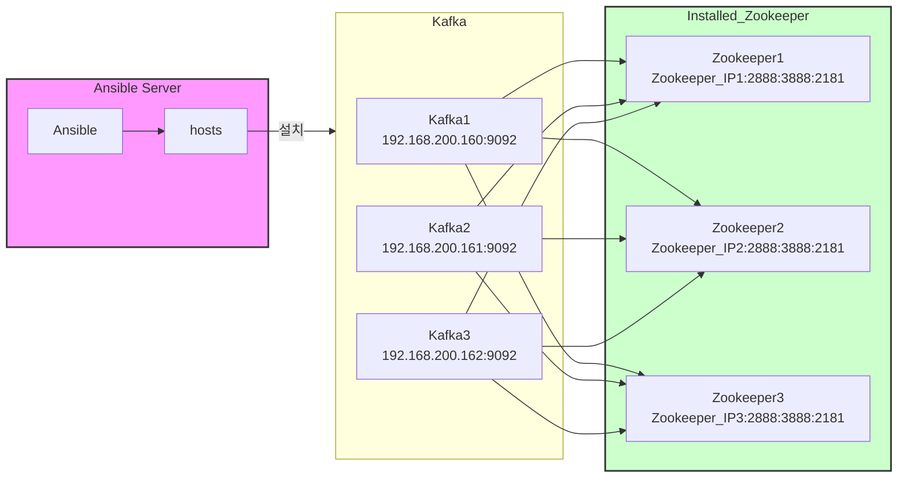

## 1. kafka
### 1.0. 실행 환경
```
HOME 경로 : /opt/kafka/kafka_X.XX-X.X.X
실행 파일 경로 : /etc/systemd/system/kafka.service
설정 파일 :/opt/kafka/config/server.propertise
DATA 경로 : /opt/kafka/kafka-data/kafka-logs
```

### 1.1. 실행
```
sudo systemctl start kakka
```

### 1.2. 종료
```
sudo systemctl stop kakka
```
### 1.3. 구조



## 2. CMAK
### 2.0. 실행 환경
```
HOME 경로 : /opt/cmak
실행 파일 경로 : /etc/systemd/system/cmak.service
설정 파일 : /opt/cmak/cmak-X.X.X.X/conf/application.conf
```
### 2.1. 실행
```
sudo systemctl start cmak
```
### 2.2. 종료
```
sudo systemctl stop cmak
```
## 3. AKHQ
### 3.0. 실행 환경
```
HOME 경로 : /opt/akhq
실행 파일 경로 : /etc/systemd/system/akhq.service
설정 파일 : /opt/akhq/akhq-X.XX.X/config/application.yml
```
### 3.1. 실행
```
sudo systemctl start cmak
```
### 3.2. 종료
```
sudo systemctl stop cmak
```
