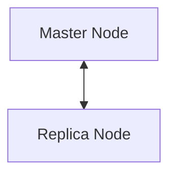

### 0. 실행 환경
```
ansible hosts 파일 경로 : /home/qubit/ansible/hosts
실행 경로 : (/usr/lib/systemd/system/mysqld.service)

파일 종류
mysql(master).yml - ansible을 통해 mysql 를 다운로드, 설치, 실행 - master 역할 노드 생성 yml
mysql(replica).yml - ansible을 통해 redis 를 다운로드, 설치, 실행 - replica 역할 노드 생성 yml
```

### 1. 설치 방법
```
ansible-playbook -i /home/qubit/ansible/hosts /home/qubit/ansible/mysql(master).yml
ansible-playbook -i /home/qubit/ansible/hosts /home/qubit/ansible/mysql(replica).yml
※ 반드시 master 먼저 생성 후 replica 생성 필요
```

### 2. 서비스 전체 종료
```
ansible -i /home/qubit/ansible/hosts redis -m command -a "sudo systemctl stop mysqld*"
```

### 3. 서비스 전체 설치 파일 삭제
```
ansible -i /home/qubit/ansible/hosts redis -m shell -a "sudo rm -rf /etc/my.cnf*"
ansible -i /home/qubit/ansible/hosts redis -m shell -a "sudo systemctl remove mysqld*"
```


### 5. 구조

