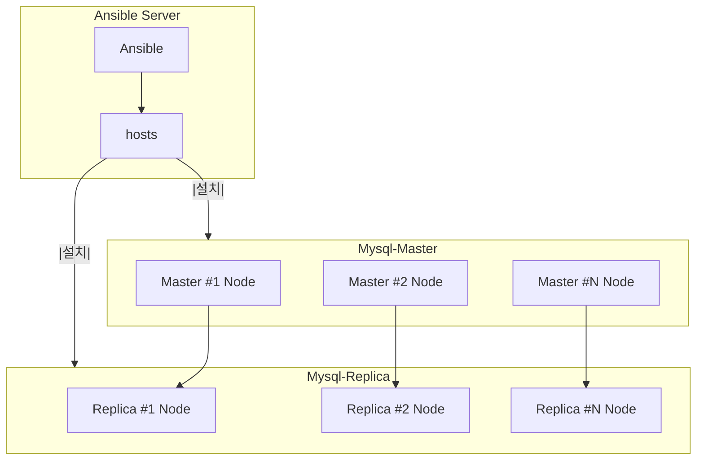

### 0. 실행 환경
```
ansible hosts 파일 경로 : /home/qubit/ansible/hosts
실행 경로 : (/usr/lib/systemd/system/redis.service

파일 종류
redis(nojson).yml - ansible을 통해 redis 를 다운로드, 설치, 실행하는 yml
redis(json).yml - ansible을 통해 redis 를 다운로드, 설치, 실행, json 모듈 적용 yml
cluser.yml - ansible을 통해 실행되는 redis를 clustering 하는 yml(redis(nojson).ym 혹은 redis(json).yml 이후 실행)
```

### 1. 설치 방법
```
ansible-playbook -i /home/qubit/ansible/hosts /home/qubit/ansible/redis(nojson).yml
ansible-playbook -i /home/qubit/ansible/hosts /home/qubit/ansible/redis(json).yml
```

### 2. 서비스 전체 종료
```
ansible -i /home/qubit/ansible/hosts redis -m command -a "sudo systemctl stop redis*"
```

### 3. 서비스 전체 설치 파일 삭제
```
ansible -i /home/qubit/ansible/hosts redis -m shell -a "sudo rm -rf /etc/redis*"
ansible -i /home/qubit/ansible/hosts redis -m shell -a "sudo systemctl remove redis"
```

### 4. 클러스터링 해제
```
ansible -i /home/qubit/ansible/hosts redis -m command -a "sudo redis-cli -h {{ ansible_host }} -p 6379 CLUSTER RESET "
```

### 5. 구조
```mermaid
graph TD;

    %% Define layout direction and spacing
    %% style Ansible_Server fill:#f9f,stroke:#333,stroke-width:2px,height:200px;
    %% style Zookeeper fill:#cfc,stroke:#333,stroke-width:2px;


    %% Ansible Server Section
    subgraph Ansible_Server[Ansible Server]
        direction TB
        Ansible1[Ansible]
        hosts[hosts]
        
        Ansible1 --> hosts
    end

    subgraph Mysql-Master
        direction TB
        Master1[Master #1 Node]
		Master2[Master #2 Node]
		MasterN[Master #N Node]
		
	end
	    
	subgraph Mysql-Replica
        Replica1[Replica #1 Node]      
        Replica2[Replica #2 Node]
        ReplicaN[Replica #N Node]
    end


    hosts -->|설치|--> Mysql-Master
	hosts -->|설치|--> Mysql-Replica

    Master1 --> Replica1
    Master2 --> Replica2
    MasterN --> ReplicaN
```


