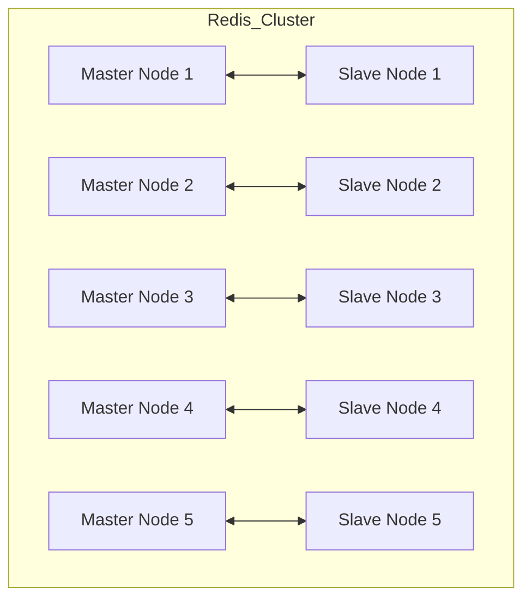

### 0. 실행 환경
```
ansible hosts 파일 경로 : /home/qubit/ansible/hosts
실행 경로 : (/usr/lib/systemd/system/redis.service

파일 종류
redis(nojson).yml - ansible을 통해 redis 를 다운로드, 설치, 실행하는 yml
redis(json).yml - ansible을 통해 redis 를 다운로드, 설치, 실행, json 모듈 적용 yml
cluser.yml - ansible을 통해 실행되는 redis를 clustering 하는 yml
```

### 1. 설치 방법
```
ansible-playbook -i /home/qubit/ansible/hosts /home/qubit/ansible/redis(nojson).yml
ansible-playbook -i /home/qubit/ansible/hosts /home/qubit/ansible/redis(json).yml
```

### 2. 서비스 전체 종료
```
ansible -i /home/qubit/ansible/hosts redis -m command -a "sudo systemctl stop redis*"
```

### 3. 서비스 전체 설치 파일 삭제
```
ansible -i /home/qubit/ansible/hosts redis -m shell -a "sudo rm -rf /etc/redis*"
ansible -i /home/qubit/ansible/hosts redis -m shell -a "sudo systemctl remove redis"
```

### 4. 클러스터링 해제
```
ansible -i /home/sysadmin/ansible/hosts redis -m command -a "sudo redis-cli -h {{ ansible_host }} -p 6379 CLUSTER RESET "
```

### 4. 구조

