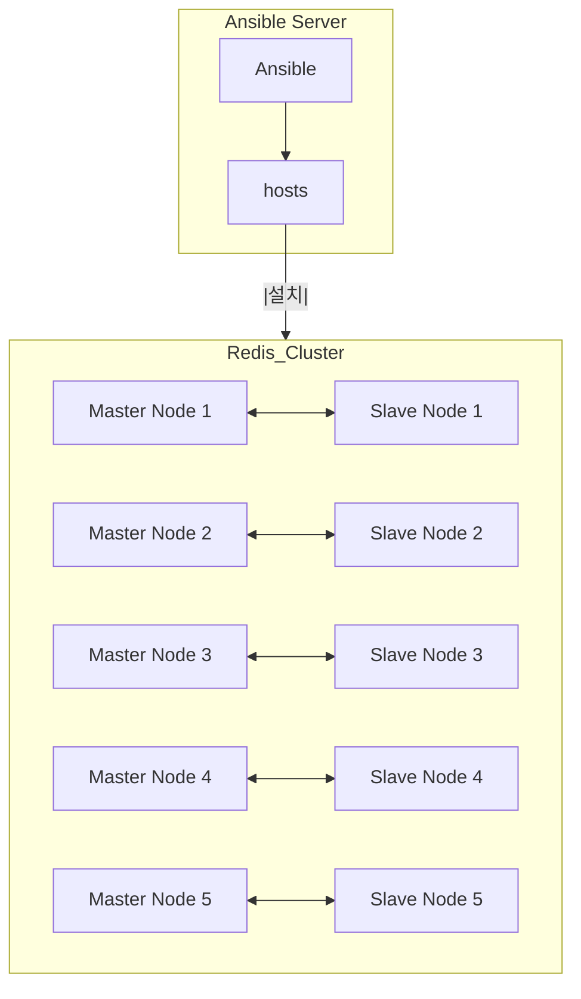

### 0. 실행 환경
```
ansible hosts 파일 경로 : /home/qubit/ansible/hosts
실행 경로 : (/usr/lib/systemd/system/redis.service)

파일 종류
redis-init.yml - 최초 ansible을 통해 redis 를 다운로드, 설치, 실행하는 yml (모듈: rejson, redisearch)
cluser-init.yml - 최초 ansible을 통해 실행되는 redis를 clustering 하는 yml(redis-init.yml 이후 실행)

(노드 추가)
redis-add_node.yml - ansible을 통해 redis 를 다운로드, 설치, 실행 후 기존 클러스터에 반영  (모듈: rejson, redisearch)
```

### 1. 설치 방법
```
ansible-playbook -i /home/qubit/ansible/hosts /home/qubit/ansible/redis-init.yml
ansible-playbook -i /home/qubit/ansible/hosts /home/qubit/ansible/cluster-init.yml

(노드 추가)
ansible-playbook -i /home/qubit/ansible/hosts /home/qubit/ansible/redis-add_node.yml
```

### 2. 서비스 전체 종료
```
ansible -i /home/qubit/ansible/hosts redis -m command -a "sudo systemctl stop redis*"
```

### 3. 서비스 전체 설치 파일 삭제
```
ansible -i /home/qubit/ansible/hosts redis -m shell -a "sudo rm -rf /etc/redis*"
ansible -i /home/qubit/ansible/hosts redis -m shell -a "sudo systemctl remove redis"
```

### 4. 클러스터링 해제
```
ansible -i /home/qubit/ansible/hosts redis -m command -a "sudo redis-cli -h {{ ansible_host }} -p 6379 CLUSTER RESET "
```

### 5. 구조

