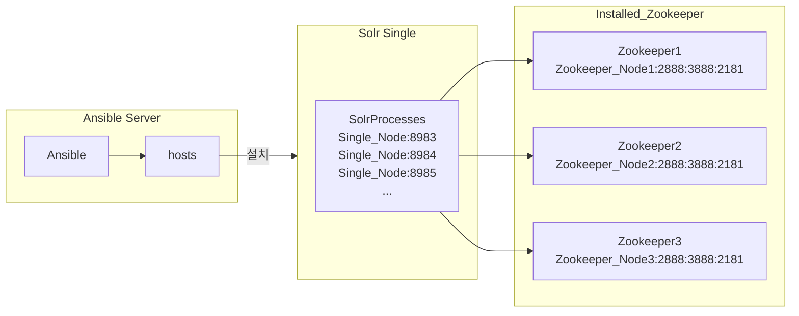

### 0. 실행 환경
```
ansible hosts 파일 경로 : /home/qubit/ansible/hosts
실행 경로 : /opt/solr

파일 종류
solr.yml - ansible을 통해 solr 를 다운로드, 설치, 실행하는 yml
```

### 1. 설치 방법
```
ansible-playbook -i /home/qubit/ansible/hosts /home/qubit/ansible/solr.yml
```

### 2. 서비스 전체 종료
```
ansible -i /home/qubit/ansible/hosts solr -m command -a "sudo systemctl stop solr*"
```

### 3. 서비스 전체 설치 파일 삭제
```
ansible -i /home/qubit/ansible/hosts solr -m shell -a "sudo rm -rf /opt/solr*"
```

### 4. 구조

