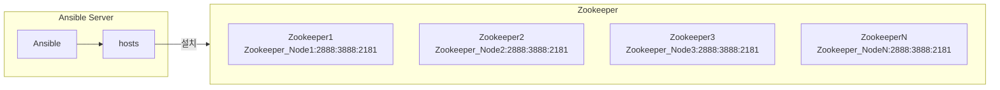

### 0. 실행 환경
```
ansible hosts 파일 경로 : /home/qubit/ansible/hosts
zookeeper 실행 경로 : /opt

파일 종류
zookeeper.yml - ansible을 통해 zookeeper를 다운로드, 설치, 실행하는 yml
```

### 1. 설치 방법
```
ansible-playbook -i /home/qubit/ansible/hosts /home/qubit/ansible/zookeeper.yml
```

### 2. 서비스 전체 종료
```
ansible -i /home/qubit/ansible/hosts zk -m command -a "sudo /opt/zk/bin/zkServer.sh stop"
```

### 3. 서비스 전체 설치 파일 삭제
```
ansible -i /home/qubit/ansible/hosts zk -m shell -a "sudo rm -rf /opt/apache-zookeeper-X.X.X-bin"
```
### 4. 구조

