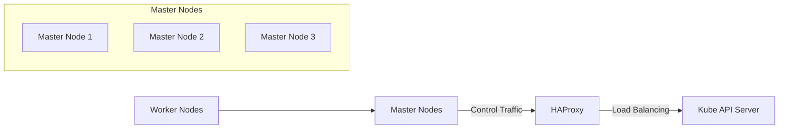
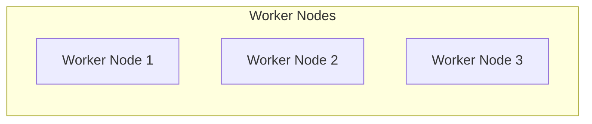

### Kubernetes 설치 가이드

## 0. 사전 준비

### 0.1 SELinux 비활성화
Kubernetes 설치 전, SELinux를 비활성화해야 합니다.

#### SELinux 일시 비활성화
```
setenforce Permissive
```

#### SELinux 상태 확인
```
getenforce
```

#### SELinux 영구 비활성화
```
vi /etc/selinux/config
```
다음과 같이 설정:
```
SELINUX=permissive
```

### 0.2 방화벽 비활성화
Kubernetes 클러스터의 통신을 위해 방화벽을 비활성화합니다.

#### 방화벽 중지 및 비활성화
```
systemctl stop firewalld
systemctl disable firewalld
```

### 0.3 네트워크 설정
Kubernetes의 네트워크 모듈을 로드합니다.

```
modprobe overlay
modprobe br_netfilter
```

#### 네트워크 모듈 영구 로드
```
vi /etc/modules-load.d/k8s.conf
```
다음과 같이 추가:
```
overlay
br_netfilter
```

### 0.4 sysctl 파라미터 설정
Kubernetes 클러스터가 정상적으로 통신할 수 있도록 sysctl 설정을 적용합니다.

```
vi /etc/sysctl.d/k8s.conf
```
다음 내용 추가:
```
net.bridge.bridge-nf-call-iptables = 1
net.ipv4.ip_forward = 1
net.bridge.bridge-nf-call-ip6tables = 1
```

#### 설정 적용
```
sysctl --system
```

### 0.5 스왑 비활성화
Kubernetes는 스왑을 비활성화해야만 설치할 수 있습니다.

```
swapoff -a
sed -i -e '/swap/d' /etc/fstab
```

## 1. 설치

### 1.1 레포지토리 설정
#### Kubernetes 및 CRI-O 레포지토리 설정
```
vi /etc/yum.repos.d/kubernetes.repo
[kubernetes]
name=Kubernetes
baseurl=https://pkgs.k8s.io/core:/stable:/v1.31/rpm/
enabled=1
gpgcheck=1
gpgkey=https://pkgs.k8s.io/core:/stable:/v1.31/rpm/repodata/repomd.xml.key

vi /etc/yum.repos.d/cri-o.repo
[cri-o]
name=CRI-O
baseurl=https://pkgs.k8s.io/addons:/cri-o:/prerelease:/main/rpm/
enabled=1
gpgcheck=1
gpgkey=https://pkgs.k8s.io/addons:/cri-o:/prerelease:/main/rpm/repodata/repomd.xml.key
```

### 1.2 패키지 설치
#### 의존성 패키지 설치
```
dnf install conntrack container-selinux ebtables ethtool iptables socat
```

#### CRI-O 및 Kubernetes 설치
```
dnf install -y --repo cri-o --repo kubernetes cri-o kubeadm kubectl kubelet
```

### 1.3 서비스 활성화 및 시작
```
systemctl enable crio
systemctl enable kubelet
systemctl start crio
systemctl status crio
```

## 2. 멀티 노드 구성

### 2.1 기본 구조
```
haproxy 2 (master1, backup1)
master 3
worker 3
```

### 2.2 HAProxy 설치 및 설정
```
dnf install haproxy
vi /etc/haproxy/haproxy.cfg
```

### 2.3 첫 번째 master 노드에서 클러스터 초기화
```
kubeadm init --control-plane-endpoint=10.100.10.100:46443 --upload-certs --pod-network-cidr=192.168.0.0/16
```
- **control-plane-endpoint**: HAProxy 연결
- **pod-network-cidr**: Pod 네트워크 대역 설정

#### master 노드 확인
```
kubectl get nodes -o wide
```

### 2.4 추가 master 및 worker 노드 설정
#### 추가 master 노드:
```
kubeadm join 10.100.10.100:46443 --token <token> --discovery-token-ca-cert-hash <hash> --control-plane --certificate-key <key>
```

#### worker 노드:
```
kubeadm join 10.100.10.100:46443 --token <token> --discovery-token-ca-cert-hash <hash>
```

## 3. CNI (Calico) 설치

### 3.1 Calico 설치
```
curl https://raw.githubusercontent.com/projectcalico/calico/v3.26.1/manifests/calico.yaml -O
```

### 3.2 Calico 설정 수정
```
vi calico.yaml
```
`CALICO_IPV4POOL_CIDR` 값을 클러스터 초기화 시 설정한 Pod 네트워크 대역과 동일하게 설정:
```
value: "192.168.0.0/16"
```

### 3.3 Calico 배포
```
kubectl apply -f calico.yaml
kubectl get pods -o wide -A
systemctl restart crio
```

## 4. Ingress 설정

### 4.1 Ingress 설치
```
curl https://raw.githubusercontent.com/kubernetes/ingress-nginx/controller-v1.11.2/deploy/static/provider/cloud/deploy.yaml -O
kubectl apply -f deploy.yaml
```

---

### Kubernetes 클러스터 동작 구성도 (Mermaid)



### Worker Nodes 구성도 (Mermaid)



이 구성도는 Kubernetes 클러스터의 기본 아키텍처를 시각적으로 나타내며, Master 및 Worker 노드, HAProxy, 그리고 Kubernetes API 서버 간의 관계를 보여줍니다.
