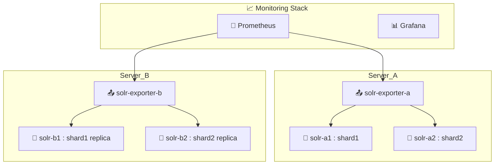

**SolrCloud 클러스터를 Docker 기반으로 안정적으로 운영**하려면, 반드시 **모니터링 및 자동화 시스템**이 함께 구축되어야 합니다.
여러 인스턴스를 운영하는 환경에서는 성능, 가용성, 장애 감지를 실시간으로 추적할 수 있어야 하기 때문입니다.

**Prometheus** 기반에 맞춰 **Solr Exporter 적용 방법과 구성 전략**입니다.

---

# 📈 Solr 모니터링 및 자동화 전략 (Prometheus 기반)

---

## ✅ 전체 구성 아키텍처



---

## 📦 Solr Exporter란?

[Apache Solr Exporter](https://github.com/apache/solr/tree/main/solr/contrib/prometheus-exporter)는
Solr 내부 상태를 Prometheus 형식으로 내보내는 HTTP endpoint 제공 도구입니다.

> Exporter는 일반적으로 **Solr 컨테이너와 함께 기동하거나 별도로 기동**하며, `/metrics` endpoint를 제공합니다.

---

## 🛠️ 1. solr-exporter Docker 컨테이너 실행 예시

```bash
docker run -d --name solr-exporter-a \
  -p 9983:9983 \
  -v /opt/solr-exporter-config:/opt/solr-exporter \
  apache/solr:8.11 \
  bin/solr-exporter \
  -p 9983 \
  -b http://host.docker.internal:8983,http://host.docker.internal:8984 \
  -f /opt/solr-exporter/solr-exporter-config.xml
```

| 항목   | 설명                             |
| ---- | ------------------------------ |
| `-b` | Solr 인스턴스 목록 (여러 개 가능)         |
| `-f` | Exporter 설정 파일                 |
| `-p` | Exporter 노출 포트 (`9983` 권장)     |
| `-v` | 설정파일 경로를 host → container로 마운트 |

> ☝️ Docker host에서 Solr 포트를 바라보는 경우 `host.docker.internal` 또는 IP 지정 필요

---

## 📁 2. solr-exporter-config.xml 예시

```xml
<solr>
  <metricNameStrategy>legacy</metricNameStrategy>
  <metrics>
    <metric registry="solr.core" group="searcher" name="queryResultCount"/>
    <metric registry="solr.core" group="update" name="adds"/>
    <metric registry="solr.jvm" group="memory" name="heap.used"/>
  </metrics>
</solr>
```

* 필요한 Solr metric만 추출 (heap, QPS, latency 등)
* 커스터마이징 가능 (shard 상태, leader 여부 등도 가능)

> 🔧 `solr-exporter-config.xml`은 Prometheus에 보내고 싶은 metric만 선택합니다.

---

## 📊 3. Prometheus `prometheus.yml` 설정

```yaml
scrape_configs:
  - job_name: 'solr-a'
    static_configs:
      - targets: ['server-a-ip:9983']

  - job_name: 'solr-b'
    static_configs:
      - targets: ['server-b-ip:9983']
```

* 각 Exporter가 제공하는 `/metrics` endpoint를 Prometheus가 수집
* 도커 내부 통신 시 `container_name:port` 사용 가능

---

## 🧭 4. Grafana 대시보드 구성

Grafana에서 다음 메트릭을 시각화할 수 있습니다:

| 메트릭 이름                             | 설명              |
| ---------------------------------- | --------------- |
| `solr_searcher_query_result_count` | 검색 요청 처리량 (QPS) |
| `solr_update_adds`                 | 색인된 문서 수        |
| `solr_jvm_memory_heap_used`        | JVM 힙 사용량       |
| `solr_core_num_docs`               | core 단위 문서 수량   |
| `solr_cache_hit_ratio`             | 캐시 효율 확인        |
| `solr_replica_is_leader`           | 리더/팔로워 구분 가능    |

> ✔️ Grafana Solr 대시보드 템플릿도 공유 가능합니다.
> 👉 [Dashboards > Solr Exporter Template](https://grafana.com/grafana/dashboards/10467-solr-exporter/)

---

## 🔄 5. 자동화 및 경보 시스템

| 구성 요소                 | 설명                                              |
| --------------------- | ----------------------------------------------- |
| **Alertmanager**      | 메모리 임계치, 리더 전환, replica down 발생 시 알림            |
| **Restart Policy**    | 컨테이너 장애 시 자동 재시작 설정 (`restart: unless-stopped`) |
| **Ansible / Compose** | Exporter 배포 자동화                                 |
| **Slack / Email 알림**  | 운영 중단 알림 (Prometheus Rule + Alertmanager 연동)    |

---

## ✅ 결론

> Docker 기반 Solr 클러스터에서 Prometheus 모니터링을 안정적으로 적용하려면:

* [x] `solr-exporter` 컨테이너를 각각 구성
* [x] Exporter 설정(`-b`, `-f`)으로 Solr 다중 노드 추적
* [x] Prometheus에 `9983` 포트를 스크레이핑
* [x] Grafana를 통해 검색, 인덱싱, JVM 상태 시각화
* [x] Alertmanager로 장애 대응 자동화

---

원하신다면 다음도 지원 가능합니다:

* `solr-exporter-config.xml` 커스터마이징 템플릿
* Prometheus Alert Rule 예시
* Grafana 템플릿 JSON 파일

언제든지 요청해 주세요!
