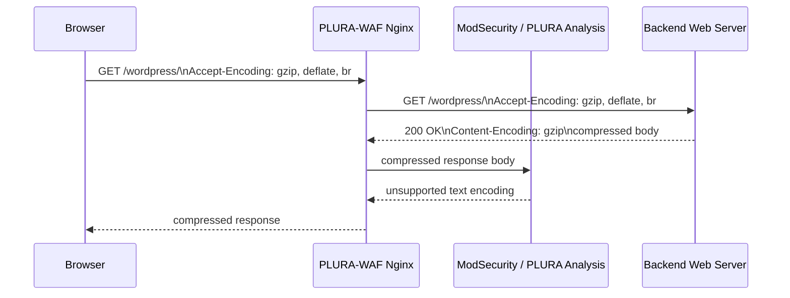
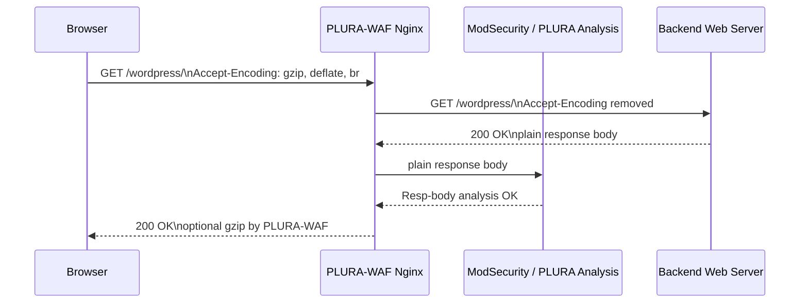

# PLURA-WAF Reverse Proxy 환경의 gzip 응답본문 분석 자동화 설계

> 문서 목적: PLURA-WAF가 Nginx Reverse Proxy로 동작하는 환경에서, 브라우저의 gzip/br 압축 요청 때문에 응답본문(`Resp-body`)이 `(unsupported text encoding)`으로 표시되는 문제를 고객 웹서버 설정 변경 없이 공통 설정으로 해결하기 위한 개발·운영 기준을 정리한다.

---

## 1. 배경

PLURA-WAF는 고객 웹서버 앞단에서 Reverse Proxy로 동작한다. 고객 웹서버는 Apache, Nginx, IIS, WebtoB, WAS 등 다양할 수 있으며, 운영 환경에서는 브라우저가 일반적으로 다음과 같은 압축 요청 헤더를 포함한다.

```http
Accept-Encoding: gzip, deflate, br
```

이 헤더가 백엔드 웹서버까지 그대로 전달되면, 백엔드는 응답본문을 gzip 또는 기타 압축 형식으로 압축하여 PLURA-WAF로 반환할 수 있다.

이 경우 PLURA-WAF 또는 연계 Agent/Collector가 응답본문을 텍스트로 분석·저장하려는 시점에 실제 데이터는 압축 바이너리 상태일 수 있으며, 그 결과 다음과 같은 현상이 발생한다.

```text
Resp-body1: (unsupported text encoding)
```

테스트에서는 백엔드 Apache에 다음 설정을 적용하면 응답본문이 정상적으로 확인되는 것이 확인되었다.

```apache
SetEnv no-gzip 1
```

그러나 고객마다 Apache/Nginx/IIS 설정을 직접 바꾸도록 요구하는 방식은 PLURA-WAF 제품 운영 방식으로 적합하지 않다.

---

## 2. 문제 정의

### 2.1 현상

PLURA-WAF 로그 화면에서 응답본문이 다음과 같이 표시된다.

```text
Resp-body1: (unsupported text encoding)
```

반면 백엔드 Apache에서 gzip을 비활성화하면 동일 요청에 대해 응답본문이 정상적으로 표시된다.

예시:

```text
Resp-body1: {"IsSuccess":false,"Msg":"XPATH syntax error: ..."}
Resp-body2: {"IsSuccess":false,"Msg":"XPATH syntax error: ..."}
```

### 2.2 원인

원인은 탐지 실패가 아니라 **응답본문 수집 지점에서 압축된 바이너리 응답을 텍스트로 해석하려는 문제**이다.

```text
Browser
  └─ Accept-Encoding: gzip, deflate, br
       ↓
PLURA-WAF / Nginx Reverse Proxy
  └─ 해당 헤더를 백엔드로 전달
       ↓
Backend Web Server
  └─ Content-Encoding: gzip 응답 생성
       ↓
PLURA-WAF / Agent / Collector
  └─ gzip 바이너리를 텍스트로 해석 시도
       ↓
Resp-body: (unsupported text encoding)
```

### 2.3 영향 범위

| 구분 | 영향 |
|---|---|
| 요청본문 기반 탐지 | 직접 영향 없음 |
| URI/헤더/쿠키/파라미터 기반 탐지 | 직접 영향 없음 |
| 응답본문 표시 | 영향 있음 |
| 응답본문 기반 분석 | 영향 있음 |
| 응답본문 기반 포렌식 증적 | 영향 있음 |
| 응답본문 기반 실시간 차단 | 평문 응답 확보가 필요 |

---

## 3. 목표

이 개선의 목표는 다음과 같다.

1. 고객 웹서버에 `no-gzip` 설정을 요구하지 않는다.
2. PLURA-WAF 공통 Nginx Reverse Proxy 설정으로 문제를 해결한다.
3. 백엔드에서 PLURA-WAF로 전달되는 응답은 평문으로 확보한다.
4. PLURA-WAF는 평문 응답본문을 분석·저장한다.
5. 최종 사용자에게는 필요 시 PLURA-WAF Nginx가 다시 gzip 압축하여 전달한다.
6. 백엔드가 강제로 gzip을 반환하는 예외 상황에 대한 fallback도 별도 고려한다.

---

## 4. 핵심 결론

PLURA-WAF가 Nginx Reverse Proxy로 동작한다면, 백엔드 요청에서 `Accept-Encoding` 헤더를 제거하는 방식이 가장 일반적인 해결책이다.

```nginx
proxy_set_header Accept-Encoding "";
```

Nginx 공식 문서 기준으로 `proxy_set_header` 값이 빈 문자열이면 해당 헤더는 proxied server로 전달되지 않는다. 따라서 위 설정을 적용하면 브라우저가 gzip/br을 요청하더라도 PLURA-WAF가 백엔드로 해당 압축 요청을 전달하지 않는다.

그 결과 백엔드는 일반적으로 압축되지 않은 평문 응답을 반환하고, PLURA-WAF는 응답본문을 정상적으로 분석할 수 있다.

---

## 5. 권장 아키텍처

### 5.1 Before



### 5.2 After



### 5.3 구조 설명

```text
Client Browser
  │
  │ 1. gzip/br 요청 가능
  ▼
PLURA-WAF Nginx Reverse Proxy
  │
  │ 2. 백엔드 요청에서는 Accept-Encoding 제거
  ▼
Backend Web Server
  │
  │ 3. 압축되지 않은 평문 응답 반환
  ▼
PLURA-WAF Nginx + ModSecurity/PLURA Analysis
  │
  │ 4. 응답본문 분석·저장
  ▼
Client Browser
     5. 필요 시 PLURA-WAF가 gzip 재압축 후 전달
```

---

## 6. Nginx 설정 설계

### 6.1 공통 include 파일 추가 권장

여러 고객/사이트/location에 반복 적용해야 하므로, 개별 server block마다 직접 작성하기보다 PLURA-WAF 공통 include 파일로 관리하는 방식을 권장한다.

예시 파일명:

```text
/etc/nginx/plura/includes/proxy_common_headers.conf
```

예시 내용:

```nginx
# PLURA-WAF common reverse proxy headers
# Purpose: keep upstream response body inspectable by PLURA-WAF.

proxy_http_version 1.1;

proxy_set_header Host              $host;
proxy_set_header X-Real-IP         $remote_addr;
proxy_set_header X-Forwarded-For   $proxy_add_x_forwarded_for;
proxy_set_header X-Forwarded-Proto $scheme;
proxy_set_header X-Forwarded-Host  $host;
proxy_set_header X-Forwarded-Port  $server_port;

# Critical setting:
# Do not forward browser compression request to backend.
# This makes the upstream response plain text in normal web-server behavior.
proxy_set_header Accept-Encoding "";
```

### 6.2 location 적용 예시

```nginx
server {
    listen 443 ssl http2;
    server_name xwaf-test.plura.io;

    # PLURA / ModSecurity 설정은 기존 정책 유지
    modsecurity on;
    modsecurity_rules_file /etc/nginx/modsec/main.conf;

    location / {
        proxy_pass http://backend_upstream;

        include /etc/nginx/plura/includes/proxy_common_headers.conf;

        # 응답본문 분석 안정성을 위해 명시
        proxy_buffering on;
    }
}
```

### 6.3 주의: `proxy_set_header` 상속 규칙

Nginx의 `proxy_set_header`는 하위 context에 `proxy_set_header`가 하나도 없을 때만 상위 context 설정을 상속한다. 따라서 `http` 또는 `server` 블록에만 `proxy_set_header Accept-Encoding "";`를 넣으면, 하위 `location`에 다른 `proxy_set_header`가 정의된 경우 적용되지 않을 수 있다.

따라서 개발 시에는 다음 중 하나를 선택해야 한다.

| 방식 | 권장 여부 | 설명 |
|---|---:|---|
| 모든 `proxy_pass` location에서 공통 include 사용 | 권장 | 누락 가능성이 가장 낮음 |
| server/http 레벨에만 설정 | 비권장 | location의 다른 `proxy_set_header` 때문에 상속이 깨질 수 있음 |
| 템플릿 렌더링 시 자동 삽입 | 권장 | PLURA-WAF 설정 생성기가 관리하는 경우 적합 |

권장 패턴:

```nginx
location / {
    proxy_pass http://backend_upstream;
    include /etc/nginx/plura/includes/proxy_common_headers.conf;
}
```

---

## 7. 클라이언트 응답 재압축 정책

백엔드 압축 요청을 제거하면 PLURA-WAF와 백엔드 사이의 응답은 평문이 된다. 하지만 최종 브라우저에게 반드시 평문으로 응답해야 하는 것은 아니다.

PLURA-WAF에서 응답본문 분석을 완료한 뒤, Nginx가 클라이언트로 전달하는 응답을 다시 gzip 압축할 수 있다.

예시:

```nginx
# http 또는 server context

gzip on;
gzip_vary on;
gzip_min_length 1024;
gzip_types
    text/plain
    text/css
    text/xml
    application/xml
    application/json
    application/javascript
    text/javascript
    image/svg+xml;
```

단, TLS 환경에서 동적 HTML 응답에 민감정보가 포함되고 사용자 입력이 반영되는 구조라면 BREACH 계열 위험을 고려해야 한다. PLURA-WAF의 기본 정책에서는 성능, 보안, 고객 서비스 특성을 고려해 재압축 대상 MIME type과 경로를 통제해야 한다.

---

## 8. ModSecurity 응답본문 분석 설정 확인

Nginx에서 백엔드 압축 요청을 제거하더라도, ModSecurity/PLURA 쪽 응답본문 분석 설정이 꺼져 있으면 `Resp-body` 분석은 수행되지 않는다.

기본 확인 항목:

```apache
SecResponseBodyAccess On
SecResponseBodyMimeTypesClear
SecResponseBodyMimeType text/plain text/html text/xml application/xml application/json application/javascript text/javascript
SecResponseBodyLimit 1048576
SecResponseBodyLimitAction ProcessPartial
```

설명:

| 설정 | 의미 |
|---|---|
| `SecResponseBodyAccess On` | 응답본문 버퍼링/분석 활성화 |
| `SecResponseBodyMimeType` | 분석 대상 MIME type 지정 |
| `SecResponseBodyLimit` | 응답본문 버퍼링 최대 크기 |
| `SecResponseBodyLimitAction ProcessPartial` | 제한 초과 시 전체 차단 대신 일부만 분석 |

주의:

- 응답본문 분석은 메모리와 지연시간에 영향을 줄 수 있다.
- 다운로드, 이미지, 동영상, 대용량 파일은 분석 대상 MIME type에서 제외해야 한다.
- JSON API 응답 분석이 필요하면 `application/json`을 반드시 포함해야 한다.

---

## 9. `SecDisableBackendCompression On`과의 관계

`SecDisableBackendCompression On`은 ModSecurity v2 계열에서 제공되던 설정이며, reverse proxy mode에서 백엔드 압축을 비활성화하기 위한 목적의 지시어이다.

그러나 PLURA-WAF가 Nginx + ModSecurity v3 구조라면 이 지시어를 주 해결책으로 사용하면 안 된다.

정리:

| 항목 | 판단 |
|---|---|
| `SecDisableBackendCompression On` | ModSecurity v2 계열 기능 |
| ModSecurity v3 | 지원되지 않음 |
| PLURA-WAF Nginx Reverse Proxy 일반 해법 | `proxy_set_header Accept-Encoding "";` |
| 고객 웹서버 `no-gzip` 설정 | 진단용 또는 예외 대응용 |

---

## 10. 예외 상황과 fallback

### 10.1 백엔드가 강제로 gzip을 반환하는 경우

일부 백엔드 또는 WAS, CDN, 프레임워크는 `Accept-Encoding`이 없어도 강제로 `Content-Encoding: gzip` 응답을 반환할 수 있다.

이 경우 대응안:

1. 백엔드 설정 오류 여부 확인
2. PLURA-WAF Nginx `gunzip` 모듈 사용 가능 여부 확인
3. Agent/Collector에서 `Content-Encoding` 기반 gzip 해제 fallback 구현

### 10.2 Nginx `gunzip on` 사용

Nginx에는 gzip 응답을 해제하는 `gunzip` 모듈이 있다.

예시:

```nginx
location / {
    proxy_pass http://backend_upstream;
    include /etc/nginx/plura/includes/proxy_common_headers.conf;

    gunzip on;
}
```

단, `gunzip` 모듈은 기본 빌드에 항상 포함되는 것이 아니며, 원래 목적은 gzip을 지원하지 않는 클라이언트에게 gzip 응답을 풀어서 전달하는 것이다. 따라서 PLURA-WAF의 기본 해법은 `gunzip on`이 아니라 **백엔드로 `Accept-Encoding`을 전달하지 않는 것**이다.

### 10.3 Brotli 응답

브라우저는 `br`을 요청할 수 있다. `proxy_set_header Accept-Encoding "";`를 적용하면 일반적으로 백엔드는 Brotli 응답도 생성하지 않는다.

다만 백엔드가 강제로 `Content-Encoding: br`을 반환하는 경우에는 Nginx 기본 gzip/gunzip 흐름으로 해결되지 않을 수 있으므로, Agent/Collector 계층에서 brotli decode 지원 여부를 별도 검토해야 한다.

### 10.4 chunked 응답

응답이 다음과 같은 형태일 수 있다.

```http
Transfer-Encoding: chunked
Content-Type: application/json
```

이 경우에는 압축 문제와 별개로 dechunk 처리가 필요하다. PLURA 분석 계층에서는 다음 순서를 지켜야 한다.

```text
1. Transfer-Encoding 처리, 예: chunked dechunk
2. Content-Encoding 처리, 예: gzip/deflate/br decode
3. Content-Type / charset 기준 텍스트 변환
4. Resp-body 저장 및 분석
```

### 10.5 WebSocket, SSE, streaming 응답

다음 유형은 응답본문 버퍼링/분석 대상에서 제외하거나 별도 정책을 적용해야 한다.

| 유형 | 권장 정책 |
|---|---|
| WebSocket | 응답본문 분석 제외 |
| Server-Sent Events | 기본 제외 또는 제한 분석 |
| 대용량 다운로드 | 제외 |
| 이미지/동영상/압축파일 | 제외 |
| HTML/JSON/XML/Text | 분석 대상 |

---

## 11. 개발 적용 방안

### 11.1 설정 템플릿 개선

PLURA-WAF Nginx 설정 생성기에 다음 항목을 기본 적용한다.

```nginx
proxy_set_header Accept-Encoding "";
```

적용 위치는 모든 `proxy_pass` location이다.

권장 구현:

```text
nginx-template/
  includes/
    proxy_common_headers.conf
  sites/
    customer-site.conf.template
```

`customer-site.conf.template` 예시:

```nginx
location {{ location_path }} {
    proxy_pass {{ upstream_url }};
    include /etc/nginx/plura/includes/proxy_common_headers.conf;
    proxy_buffering on;
}
```

### 11.2 설정 옵션화

운영 안전성을 위해 다음 옵션을 내부 설정값으로 둘 수 있다.

```yaml
plura_waf:
  upstream_accept_encoding_policy: strip
  client_recompression: on
  response_body_analysis: on
  response_body_decode_fallback: on
```

정책값:

| 값 | 설명 |
|---|---|
| `strip` | 백엔드로 `Accept-Encoding` 전달 안 함. 기본값 권장 |
| `pass` | 백엔드로 원본 `Accept-Encoding` 전달. 응답본문 분석 제한 발생 가능 |
| `identity` | 백엔드로 `Accept-Encoding: identity` 전달. 일부 서버 호환성 확인 필요 |

권장 기본값:

```yaml
upstream_accept_encoding_policy: strip
```

### 11.3 로그 필드 개선

문제 진단을 위해 다음 필드를 추가하는 것이 좋다.

```json
{
  "Resp-Content-Encoding": "",
  "Resp-Transfer-Encoding": "chunked",
  "Resp-body-decode": "not_required",
  "Resp-body-text-status": "ok",
  "Resp-body-truncated": false
}
```

압축 응답이 여전히 들어온 경우:

```json
{
  "Resp-Content-Encoding": "gzip",
  "Resp-body-decode": "failed",
  "Resp-body-decode-reason": "gzip_decompression_failed",
  "Resp-body-text-status": "unsupported_text_encoding"
}
```

fallback 해제 성공 시:

```json
{
  "Resp-Content-Encoding": "gzip",
  "Resp-body-decode": "success",
  "Resp-body-text-status": "ok"
}
```

---

## 12. 검증 절차

### 12.1 Nginx 설정 검증

```bash
nginx -t
systemctl reload nginx
```

### 12.2 클라이언트 요청 검증

브라우저와 동일하게 압축 요청을 보낸다.

```bash
curl -k -I \
  -H 'Accept-Encoding: gzip, deflate, br' \
  https://xwaf-test.plura.io/wordpress/
```

### 12.3 백엔드 수신 헤더 검증

백엔드 웹서버 access log 또는 임시 debug endpoint에서 `Accept-Encoding`이 전달되지 않는지 확인한다.

기대 결과:

```text
Accept-Encoding: 없음
```

### 12.4 백엔드 응답 검증

PLURA-WAF와 백엔드 사이에서 응답이 평문인지 확인한다.

기대 결과:

```text
Content-Encoding: 없음
```

### 12.5 PLURA-WAF 로그 검증

기대 결과:

```text
Resp-body1: <text/html 또는 application/json 응답본문>
```

실패 결과:

```text
Resp-body1: (unsupported text encoding)
```

### 12.6 최종 사용자 응답 검증

PLURA-WAF에서 클라이언트 재압축을 켠 경우, 최종 클라이언트 응답에는 gzip이 적용될 수 있다.

```bash
curl -k -I \
  -H 'Accept-Encoding: gzip' \
  https://xwaf-test.plura.io/wordpress/
```

가능한 기대 결과:

```text
Content-Encoding: gzip
Vary: Accept-Encoding
```

단, 이 gzip은 백엔드가 생성한 것이 아니라 PLURA-WAF가 응답본문 분석 후 최종 사용자에게 전달하면서 적용한 것이다.

---

## 13. Acceptance Criteria

| ID | 기준 | 기대 결과 |
|---|---|---|
| AC-01 | 브라우저가 gzip/br 요청 | PLURA-WAF는 요청을 정상 수신 |
| AC-02 | 백엔드로 전달되는 요청 | `Accept-Encoding` 제거됨 |
| AC-03 | 백엔드 응답 | 기본적으로 `Content-Encoding` 없음 |
| AC-04 | PLURA-WAF 응답본문 분석 | `Resp-body`가 텍스트로 표시됨 |
| AC-05 | 기존 `(unsupported text encoding)` 현상 | 재현되지 않음 |
| AC-06 | JSON 응답 | `application/json` 응답본문 표시 가능 |
| AC-07 | 최종 클라이언트 gzip | PLURA-WAF에서 재압축 가능 |
| AC-08 | 고객 웹서버 설정 변경 | 필요 없음 |
| AC-09 | 대용량/binary 응답 | 분석 제외 또는 partial 처리 |
| AC-10 | rollback | 설정 제거 후 reload로 원복 가능 |

---

## 14. 운영 정책

### 14.1 기본 정책

PLURA-WAF 표준 정책은 다음과 같다.

```text
고객 웹서버의 gzip 설정을 변경하지 않는다.
PLURA-WAF Nginx Reverse Proxy에서 백엔드 요청의 Accept-Encoding을 제거한다.
PLURA-WAF는 백엔드 평문 응답을 분석한다.
최종 클라이언트 응답은 PLURA-WAF에서 필요 시 다시 압축한다.
```

### 14.2 고객 안내 기준

고객에게 다음과 같은 설정을 요구하지 않는다.

```apache
SetEnv no-gzip 1
```

이 설정은 다음 경우에만 안내한다.

| 경우 | 설명 |
|---|---|
| 현장 긴급 진단 | PLURA-WAF 설정 변경 전 임시 확인 |
| 백엔드 강제 압축 의심 | 원인 분리 목적 |
| Reverse Proxy 우회 구성 | PLURA-WAF를 거치지 않는 테스트 |

### 14.3 제품 문구 기준

기존 표현:

```text
Apache 설정에서 no-gzip 옵션을 적용하면 Resp-body 값을 정상적으로 확인할 수 있다.
```

권장 표현:

```text
gzip 압축 응답의 경우, 응답본문 분석 지점에서 평문 응답을 확보해야 한다.
PLURA-WAF는 Nginx Reverse Proxy 구조이므로 고객 웹서버 설정 변경 없이
백엔드 요청의 Accept-Encoding 헤더를 제거하여 평문 응답을 확보하는 방식을 표준으로 적용한다.
Apache no-gzip 설정은 진단용 또는 예외 대응용으로만 사용한다.
```

---

## 15. Rollback 방안

문제가 발생할 경우 다음 순서로 원복한다.

1. 해당 customer/site location에서 공통 include 제거 또는 옵션 변경
2. `proxy_set_header Accept-Encoding "";` 비활성화
3. Nginx 설정 테스트
4. Nginx reload
5. PLURA-WAF 로그 및 고객 서비스 정상성 확인

명령 예시:

```bash
nginx -t && systemctl reload nginx
```

옵션 기반인 경우:

```yaml
plura_waf:
  upstream_accept_encoding_policy: pass
```

---

## 16. 개발자 작업 목록

### 16.1 필수 작업

- [ ] PLURA-WAF Nginx 공통 proxy header include 파일 추가
- [ ] 모든 `proxy_pass` location에 include 적용
- [ ] `proxy_set_header Accept-Encoding "";` 누락 여부 자동 검사
- [ ] Nginx 설정 생성기/template 수정
- [ ] 응답본문 분석 대상 MIME type 재확인
- [ ] `application/json` 응답본문 분석 지원 확인
- [ ] `proxy_set_header` 상속 규칙으로 인한 누락 방지
- [ ] 통합 테스트 추가

### 16.2 권장 작업

- [ ] PLURA 로그에 `Resp-Content-Encoding` 필드 추가
- [ ] PLURA 로그에 `Resp-body-decode` 상태 필드 추가
- [ ] fallback gzip decode 기능 검토
- [ ] Brotli decode 필요성 검토
- [ ] 대용량/binary 응답 제외 정책 명문화
- [ ] UI에서 `(unsupported text encoding)` 대신 원인 표시 개선

### 16.3 테스트 케이스

| TC | 내용 | 기대 결과 |
|---|---|---|
| TC-01 | 브라우저 gzip 요청 | 백엔드에는 `Accept-Encoding` 미전달 |
| TC-02 | WordPress HTML 응답 | `Resp-body` 정상 표시 |
| TC-03 | JSON 오류 응답 | `Resp-body` 정상 표시 |
| TC-04 | SQLi/XPath 오류 응답 | 응답본문 증적 정상 수집 |
| TC-05 | 대용량 파일 다운로드 | 분석 제외 또는 partial 처리 |
| TC-06 | 백엔드 강제 gzip | fallback 또는 명확한 실패 사유 기록 |
| TC-07 | 클라이언트 재압축 | 최종 응답 gzip 가능 |
| TC-08 | Nginx reload | 무중단 반영 |

---

## 17. 최종 결론

PLURA-WAF가 Nginx Reverse Proxy로 동작하는 환경에서는 고객 웹서버별로 `no-gzip` 설정을 적용할 필요가 없다.

제품 표준 해법은 PLURA-WAF Nginx 설정에서 백엔드로 전달되는 `Accept-Encoding` 헤더를 제거하는 것이다.

```nginx
proxy_set_header Accept-Encoding "";
```

이 방식은 다음 장점이 있다.

1. 고객 웹서버 설정 변경이 필요 없다.
2. Apache/Nginx/IIS 등 백엔드 종류와 무관하게 일반화할 수 있다.
3. PLURA-WAF가 응답본문을 평문으로 분석할 수 있다.
4. 최종 사용자에게는 PLURA-WAF에서 다시 gzip 압축을 제공할 수 있다.
5. `Resp-body: (unsupported text encoding)` 문제를 제품 공통 설정으로 해결할 수 있다.

따라서 개발팀은 `proxy_set_header Accept-Encoding "";`를 PLURA-WAF Nginx Reverse Proxy 공통 템플릿에 반영하고, 모든 `proxy_pass` location에 누락 없이 적용되도록 설정 생성기와 테스트를 보강해야 한다.

---

## 18. 참고 문서

- Nginx `proxy_set_header` 공식 문서  
  https://nginx.org/en/docs/http/ngx_http_proxy_module.html#proxy_set_header

- Nginx Reverse Proxy 공식 문서  
  https://docs.nginx.com/nginx/admin-guide/web-server/reverse-proxy/

- Nginx gzip module 공식 문서  
  https://nginx.org/en/docs/http/ngx_http_gzip_module.html

- Nginx gunzip module 공식 문서  
  https://nginx.org/en/docs/http/ngx_http_gunzip_module.html

- Nginx Compression and Decompression 공식 문서  
  https://docs.nginx.com/nginx/admin-guide/web-server/compression/

- ModSecurity v3 Reference Manual  
  https://github.com/owasp-modsecurity/ModSecurity/wiki/Reference-Manual-%28v3.x%29

- ModSecurity v2 Reference Manual: `SecDisableBackendCompression`  
  https://github.com/owasp-modsecurity/ModSecurity/wiki/Reference-Manual-%28v2.x%29#SecDisableBackendCompression
