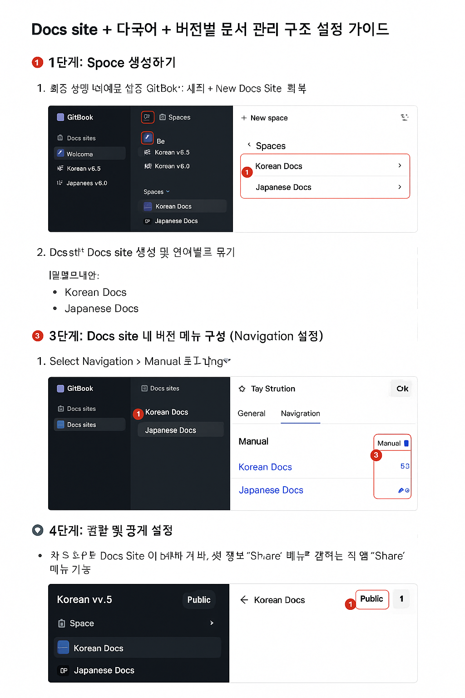

아래는 **GitBook SaaS** 기준으로 **Docs site + 다국어 + 버전별 문서 관리 구조 설정**을 위한 **단계별 시나리오 및 캡처 설명 가이드**입니다.

---

## ✅ 시나리오 목표

**다국어(`Korean`, `Japanese`) + 버전별(`v5.5`, `v6.0`) 문서를 깔끔하게 관리하고 GitBook Docs Site로 통합 제공**

---

## 🧭 1단계: Space 생성하기

1. **GitBook 로그인** 후 좌측 메뉴에서 `+ New space` 클릭
2. 이름 예시:

   * `Korean v5.5`
   * `Korean v6.0`
   * `Japanese v5.5`
   * `Japanese v6.0`

📸 예상 위치:

```
Spaces
├── Korean v5.5
├── Korean v6.0
├── Japanese v5.5
└── Japanese v6.0
```

👉 각 Space는 독립된 문서로, 내부에서 `README`, `SUMMARY`, `install.md` 등 페이지 구성 가능

---

## 🌐 2단계: Docs Site 생성 및 언어별로 묶기

1. 좌측 메뉴 `Docs sites > + New Docs Site` 클릭
2. 이름 예시:

   * `Korean Docs`
   * `Japanese Docs`

📸 구성 예:

```
Docs Sites
├── Korean Docs
│   ├── Korean v5.5
│   └── Korean v6.0
└── Japanese Docs
    ├── Japanese v5.5
    └── Japanese v6.0
```

> 📌 **"Add spaces"** 버튼으로 해당 언어의 각 버전 Space들을 선택해 포함시킵니다.

---

## 🧩 3단계: Docs Site 내 버전 메뉴 구성 (Navigation 설정)

1. Docs site 설정에서 **Navigation > Manual** 선택
2. 메뉴 구조를 다음처럼 구성:

```yaml
Korean Docs:
  - v5.5 (링크: Korean v5.5 Space)
  - v6.0 (링크: Korean v6.0 Space)

Japanese Docs:
  - v5.5 (링크: Japanese v5.5 Space)
  - v6.0 (링크: Japanese v6.0 Space)
```

📸 설정 위치:

* Docs Site > 좌측 상단 설정 ⚙️ > "Navigation"

> ✅ 이렇게 하면 사용자가 상단 메뉴에서 버전별 문서를 전환할 수 있습니다.

---

## 🛡️ 4단계: 권한 및 공개 설정

* 각 Space 혹은 전체 Docs Site를 **Public** 또는 **Private**으로 설정 가능
* 권한 관리: `Share` 메뉴에서 팀원 초대 및 읽기/쓰기 설정 가능

---

## 📄 5단계: GitHub 업로드용 구조 예시

로컬에 다운받아 다음과 같이 GitHub에 업로드하면 좋습니다:

```
plura-docs-ko-ja-v5-v6/
├── README.md
├── ko/
│   ├── v5.5/
│   │   ├── README.md
│   │   └── install.md
│   └── v6.0/
│       ├── README.md
│       └── ...
└── ja/
    ├── v5.5/
    │   ├── README.md
    │   └── ...
    └── v6.0/
        ├── README.md
        └── ...
```

---

## 📝 README.md 예시

```markdown
# PLURA Product Documentation (Korean & Japanese)

This repository contains multi-language and multi-version product documentation.

## Structure

- `ko/v5.5` : Korean docs for version 5.5
- `ko/v6.0` : Korean docs for version 6.0
- `ja/v5.5` : Japanese docs for version 5.5
- `ja/v6.0` : Japanese docs for version 6.0

## How to contribute

1. Clone the repository
2. Update the corresponding Markdown files
3. Submit a pull request
```

---



