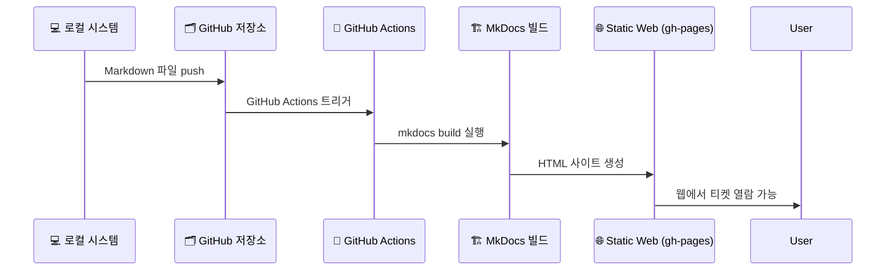

문서의 `MkDocs 빌드 (정적 사이트 생성)` 부분이 정확히 **무엇을 하는지** 안내입니다.

---

## 🧰 MkDocs 빌드란 무엇인가요?

**MkDocs**는 Markdown 파일로 된 문서를 보기 좋게 **정적 웹사이트**(HTML)로 변환해주는 도구입니다.

### 🔧 “빌드(Build)”의 의미

`mkdocs build` 명령어는 다음 작업을 수행합니다:

| 순서  | 작업 내용                                   |
| --- | --------------------------------------- |
| 1️⃣ | `docs/` 디렉터리에 있는 `.md` 파일들을 모두 읽음       |
| 2️⃣ | 설정 파일 `mkdocs.yml`을 참조해서 메뉴 구조와 테마 적용   |
| 3️⃣ | 결과물을 `site/` 폴더에 **HTML/CSS/JS** 파일로 변환 |
| 4️⃣ | 이 정적 파일들은 GitHub Pages 등에 배포 가능         |

---

## 🖼️ 시각적 예시

```bash
docs/
└── tickets/
    └── abcdEFgh/2025/08/04/issue-12345.md
```

Markdown 파일이 다음처럼 변합니다:

```
↓ `mkdocs build` 실행 후 ↓

site/
└── tickets/
    └── abcdEFgh/2025/08/04/issue-12345/index.html
```

👉 이 HTML 파일은 웹 브라우저에서 **정적 웹페이지**로 보여지게 됩니다.

---

## 🔄 전체 흐름과 MkDocs의 역할

다시 한 번 `Mermaid 시퀀스`로 강조해보면:



---

## 🧪 MkDocs 빌드의 결과물은 어디에?

GitHub Actions는 빌드된 HTML 파일들을  
👉 `site/` 폴더에 저장하고  
👉 이를 `gh-pages` 브랜치로 자동 배포합니다.  

결과적으로 여러분은 이런 URL로 티켓을 열람하게 됩니다:

```
https://your-username.github.io/xTrace/tickets/abcdEFgh/2025/08/04/issue-12345/
```

---

## ✅ 요약

| 질문                | 답변                                                    |
| ----------------- | ----------------------------------------------------- |
| **MkDocs 빌드란?**   | Markdown → HTML 로 정적 웹사이트 생성하는 작업                     |
| **언제 실행되나요?**     | GitHub에 티켓 푸시(push) 시 GitHub Actions가 자동 실행           |
| **왜 필요한가요?**      | Markdown 파일을 **누구나 웹에서 볼 수 있도록** 하려면 HTML로 변환해야 하기 때문 |
| **결과는 어디에서 보나요?** | `gh-pages` 브랜치를 통해 GitHub Pages에서 볼 수 있어요             |

---
