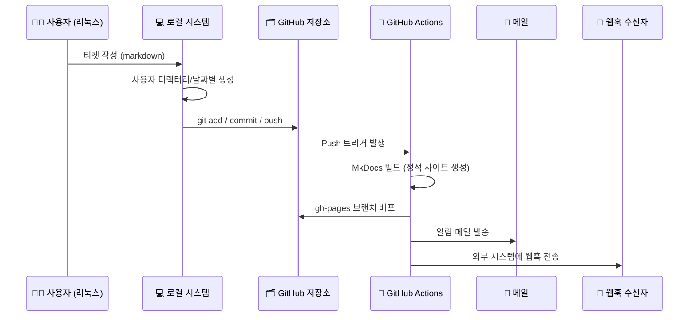

# 🛠️ GitHub 기반 티켓 자동화 시스템 구성 문서

---

## ✅ 전체 흐름 요약



---

## 📂 디렉터리 구조

```bash
xTrace/
├── docs/
│   └── tickets/
│       └── abcdEFgh/2025/08/02/issue-001.md
├── mkdocs.yml
├── .github/
│   └── workflows/
│       └── deploy.yml
├── ticket-create.sh   # 로컬에서 실행할 스크립트
```

---

## 🖥️ 1. 리눅스에서 티켓 생성 스크립트 (`ticket-create.sh`)

```bash
#!/bin/bash

# 사용자 ID 및 이슈 제목 입력
USER_ID="abcdEFgh"  # 사용자 고유 ID
TITLE=$1

# 날짜 계산
DATE=$(date '+%Y/%m/%d')
YEAR=$(date '+%Y')
MONTH=$(date '+%m')
DAY=$(date '+%d')

# 티켓 파일 경로 설정
FILE="docs/tickets/${USER_ID}/${YEAR}/${MONTH}/${DAY}/issue-${RANDOM}.md"
mkdir -p "$(dirname "$FILE")"

# 티켓 내용 작성
cat <<EOF > "$FILE"
# 🐞 Ticket: $TITLE

**생성일:** $(date '+%Y-%m-%d %H:%M:%S')  
**작성자 ID:** $USER_ID  

---

## 📌 내용

- 설명: $TITLE
- 상태: 신규
- 우선순위: 보통

EOF

echo "[✅] Created ticket at: $FILE"
```

> 실행 예시:

```bash
chmod +x ticket-create.sh
./ticket-create.sh "서버 과부하 문제 발생"
```

---

## 🔄 2. GitHub에 업로드 (커밋 + 푸시)

```bash
git add docs/tickets/
git commit -m "📝 New ticket: 서버 과부하 문제 발생"
git push origin main
```

---

## ⚙️ 3. GitHub Actions Workflow (`.github/workflows/deploy.yml`)

```yaml
name: 🚀 Build & Deploy xTrace

on:
  push:
    branches: [main]   # main 브랜치에 push 시 작동

jobs:
  build-and-deploy:
    runs-on: ubuntu-latest

    steps:
    - name: 📥 Checkout Repository
      uses: actions/checkout@v3

    - name: 🧰 Setup Python
      uses: actions/setup-python@v4
      with:
        python-version: '3.10'

    - name: 📦 Install MkDocs + Theme
      run: |
        pip install mkdocs mkdocs-material

    - name: 🛠️ Build MkDocs
      run: mkdocs build

    - name: 🚚 Deploy to GitHub Pages
      uses: peaceiris/actions-gh-pages@v3
      with:
        github_token: ${{ secrets.GITHUB_TOKEN }}
        publish_dir: ./site

    - name: 📩 Send Email Notification
      uses: dawidd6/action-send-mail@v3
      with:
        server_address: smtp.gmail.com
        server_port: 465
        username: ${{ secrets.EMAIL_USERNAME }}
        password: ${{ secrets.EMAIL_PASSWORD }}
        subject: "New Ticket Submitted"
        body: "새로운 티켓이 등록되었습니다: ${{ github.event.head_commit.message }}"
        to: user@example.com
        from: xTrace Bot <bot@example.com>

    - name: 🔔 Webhook Notification
      run: |
        curl -X POST https://webhook.example.com/ticket \
             -H 'Content-Type: application/json' \
             -d '{"message": "New ticket submitted", "user": "abcdEFgh"}'
```

---

## 🧪 4. 테스트 결과 (예시)

* GitHub `main` 브랜치에 티켓 push → `gh-pages` 브랜치로 자동 배포됨
* 티켓이 웹사이트에 즉시 반영됨 (예: `https://your-org.github.io/xTrace`)
* 메일 수신 확인 (제목: `New Ticket Submitted`)
* 웹훅 서버에 JSON 발송 성공 확인

---

## ✨ 확장 아이디어

| 기능                 | 방식                              |
| ------------------ | ------------------------------- |
| 🧾 템플릿 기반 티켓 생성    | issue-template.md 참조하여 자동화 가능   |
| 🔍 티켓 검색 기능 추가     | MkDocs search + 날짜/태그 기반 필터링    |
| 🛡️ 인증 기반 제출 인터페이스 | GitHub OAuth 또는 서버 사이드 인증 추가 가능 |
| 🧑 사용자 ↔ 난수 매핑 관리  | `users.json` 파일로 이름 ↔ ID 관리 가능  |

---

## ✅ 요약 체크리스트

* [x] 리눅스에서 티켓 생성 스크립트 작성
* [x] GitHub에 push 자동화
* [x] GitHub Actions로 MkDocs 빌드 및 배포
* [x] 이메일 알림 설정 (SMTP 필요)
* [x] 외부 시스템 웹훅 호출 설정

---
