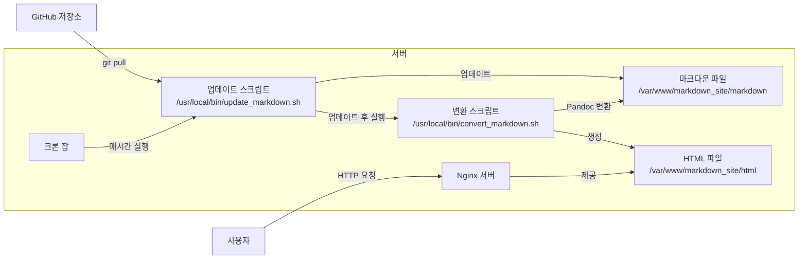

# 정적 사이트 생성기(Static Site Generator, SSG)

마크다운 문서를 GitHub에서 가져와 HTML로 변환하여 가볍게 보여주는 웹 서버를 **Rocky Linux 8** 환경에서 구축하려면 다음과 같이 진행하시면 됩니다:

---



---

### **1. Nginx 설치 및 설정**

**1.1. Nginx 설치**

Rocky Linux 8에서 Nginx를 설치하려면 EPEL(Extra Packages for Enterprise Linux) 리포지토리를 추가해야 합니다.

```bash
sudo dnf install epel-release -y
sudo dnf install nginx -y
```

**1.2. Nginx 서비스 시작 및 부팅 시 자동 시작 설정**

```bash
sudo systemctl start nginx
sudo systemctl enable nginx
```

**1.3. 방화벽 설정 (필요한 경우)**

HTTP 서비스를 허용하도록 방화벽을 설정합니다.

```bash
sudo firewall-cmd --permanent --add-service=http
sudo firewall-cmd --reload
```

**1.4. 서버 블록 설정**

Nginx 설정 파일을 편집하여 문서를 제공할 디렉토리를 설정합니다.

- 설정 파일 생성: `/etc/nginx/conf.d/markdown_site.conf`

```nginx
server {
    listen 80;
    server_name _;

    root /var/www/markdown_site/html;
    index index.html;

    location / {
        try_files $uri $uri/ =404;
    }
}
```

**1.5. Nginx 구성 확인 및 재시작**

```bash
sudo nginx -t
sudo systemctl restart nginx
```

---

### **2. GitHub에서 문서 가져오기**

**2.1. 디렉토리 생성 및 저장소 클론**

```bash
sudo mkdir -p /var/www/markdown_site/markdown
sudo chown -R $USER:$USER /var/www/markdown_site
git clone https://github.com/yourusername/yourrepo.git /var/www/markdown_site/markdown
```

**2.2. 업데이트 스크립트 작성**

- 스크립트 파일 생성: `/usr/local/bin/update_markdown.sh`

```bash
#!/bin/bash
cd /var/www/markdown_site/markdown
git pull origin main
```

- 실행 권한 부여

```bash
sudo chmod +x /usr/local/bin/update_markdown.sh
```

**2.3. 크론 잡 설정**

```bash
crontab -e
```

다음 라인을 추가하여 매시간마다 업데이트되도록 설정합니다.

```
0 * * * * /usr/local/bin/update_markdown.sh
```

---

### **3. 마크다운을 HTML로 변환**

**3.1. Pandoc 설치**

Rocky Linux 8에서 Pandoc을 설치하려면 추가 리포지토리를 설정하거나 바이너리를 직접 설치해야 합니다.

- **방법 1: 리포지토리에서 설치**

EPEL 리포지토리에 Pandoc 패키지가 포함되어 있습니다.

```bash
sudo dnf install pandoc -y
```

- **방법 2: 바이너리 직접 설치**

Pandoc 공식 사이트에서 최신 버전을 다운로드하여 설치할 수 있습니다.

```bash
sudo dnf install wget -y
wget https://github.com/jgm/pandoc/releases/download/2.19.2/pandoc-2.19.2-linux-amd64.tar.gz
tar xvzf pandoc-2.19.2-linux-amd64.tar.gz
sudo cp -r pandoc-2.19.2/bin/* /usr/local/bin/
sudo cp -r pandoc-2.19.2/share/* /usr/local/share/
```

**3.2. 변환 스크립트 작성**

- 스크립트 파일 생성: `/usr/local/bin/convert_markdown.sh`

```bash
#!/bin/bash
INPUT_DIR="/var/www/markdown_site/markdown"
OUTPUT_DIR="/var/www/markdown_site/html"

mkdir -p "$OUTPUT_DIR"

find "$INPUT_DIR" -name "*.md" | while read -r file; do
    relative_path="${file#$INPUT_DIR/}"
    output_file="$OUTPUT_DIR/${relative_path%.md}.html"
    output_dir=$(dirname "$output_file")
    mkdir -p "$output_dir"
    pandoc "$file" -o "$output_file"
done
```

- 실행 권한 부여

```bash
sudo chmod +x /usr/local/bin/convert_markdown.sh
```

**3.3. 크론 잡에 변환 스크립트 추가**

```bash
crontab -e
```

다음 라인을 추가하여 업데이트 및 변환 스크립트를 매시간마다 실행합니다.

```
0 * * * * /usr/local/bin/update_markdown.sh && /usr/local/bin/convert_markdown.sh
```

---

### **4. Nginx에서 HTML 파일 제공**

**4.1. Nginx 설정 확인**

Nginx 설정 파일에서 `root` 디렉토리가 `/var/www/markdown_site/html`로 설정되어 있는지 확인합니다.

**4.2. Nginx 재시작**

```bash
sudo systemctl restart nginx
```

---

### **5. 추가 설정 (선택 사항)**

**5.1. 스타일 적용**

- CSS 파일 추가: `/var/www/markdown_site/html/css/style.css`

- 변환 스크립트 수정 (`convert_markdown.sh`)

```bash
pandoc "$file" -c "/css/style.css" -o "$output_file"
```

**5.2. 파일 변경 감지하여 자동 변환**

실시간 변환을 원하신다면 `inotify-tools`를 설치하고 `inotifywait`를 사용하여 파일 변경을 감지할 수 있습니다.

- **`inotify-tools` 설치**

```bash
sudo dnf install inotify-tools -y
```

- **파일 변경 감지 스크립트 작성**

이 부분은 시스템 리소스 사용량을 증가시킬 수 있으므로 주의가 필요합니다.

---

이렇게 설정하시면 Rocky Linux 8 환경에서 GitHub의 마크다운 문서를 자동으로 HTML로 변환하고, Nginx를 통해 가볍게 제공할 수 있습니다. 복잡한 환경 없이도 원하는 기능을 구현할 수 있으며, 필요에 따라 추가 설정을 통해 사이트를 더욱 풍부하게 구성할 수 있습니다.

---

**참고 사항:**

- **권한 설정:** 웹 서버가 파일에 접근할 수 있도록 `/var/www/markdown_site` 디렉토리의 권한을 적절히 설정해야 합니다.
- **보안 고려:** 공개된 웹 서버인 만큼 보안 설정을 꼼꼼히 확인하시기 바랍니다.
- **로그 관리:** 크론 잡 및 스크립트 실행 시 발생하는 로그를 관리하여 문제 발생 시 원인을 파악하기 쉽게 합니다.

---
