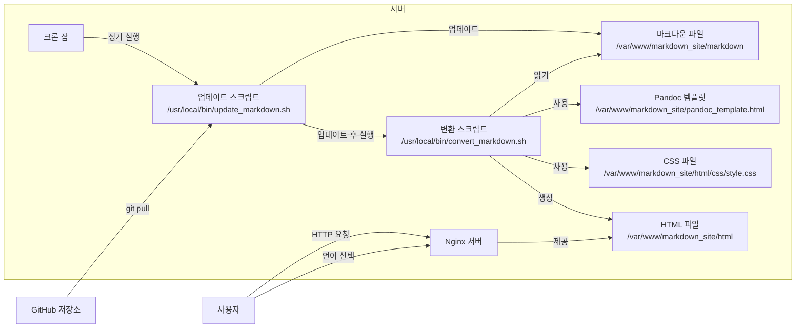

기존에 설정한 SSG 시스템과 앞서 작성한 `/css/style.css`를 어떻게 자동으로 연동시키는지 설명드리겠습니다.

**목표:**

- Pandoc을 사용하여 마크다운 파일을 HTML로 변환할 때, `/css/style.css`를 포함하여 스타일이 적용된 HTML 파일을 생성합니다.
- 언어별로 적절한 폰트가 적용되도록 HTML 파일을 생성합니다.
- 언어 선택 기능을 제공하여 사용자들이 원하는 언어로 사이트를 볼 수 있도록 합니다.

---



---

### **1. 변환 스크립트 수정**

기존의 변환 스크립트 `/usr/local/bin/convert_markdown.sh`를 수정하여 Pandoc이 CSS 파일과 언어 정보를 포함한 HTML 파일을 생성하도록 합니다.

**수정된 변환 스크립트:**

```bash
#!/bin/bash
INPUT_DIR="/var/www/markdown_site/markdown"
OUTPUT_DIR="/var/www/markdown_site/html"
CSS_FILE="/css/style.css"

mkdir -p "$OUTPUT_DIR"

find "$INPUT_DIR" -name "*.md" | while read -r file; do
    relative_path="${file#$INPUT_DIR/}"
    filename=$(basename "$file")
    filename_without_ext="${filename%.md}"
    lang_code="${filename_without_ext##*.}" # 파일명에서 언어 코드를 추출 (예: filename.en.md)

    # 언어 코드를 추출할 수 없는 경우 기본 언어를 설정
    if [[ "$lang_code" != "en" && "$lang_code" != "ko" && "$lang_code" != "ja" ]]; then
        lang_code="en"
    fi

    output_file="$OUTPUT_DIR/${relative_path%.md}.html"
    output_dir=$(dirname "$output_file")
    mkdir -p "$output_dir"

    pandoc "$file" \
        -o "$output_file" \
        --standalone \
        --metadata=lang:"$lang_code" \
        -c "$CSS_FILE" \
        --metadata title="Your Site Title"

done
```

**설명:**

- `--standalone`: 완전한 HTML 문서를 생성합니다.
- `--metadata=lang:"$lang_code"`: HTML 문서의 `<html>` 태그에 `lang` 속성을 추가합니다.
- `-c "$CSS_FILE"`: CSS 파일을 링크하여 스타일을 적용합니다.
- 파일명에서 언어 코드를 추출하여 해당 언어의 폰트가 적용되도록 합니다. 예를 들어, `filename.en.md`, `filename.ko.md`, `filename.ja.md` 등으로 파일명을 지정합니다.

---

### **2. CSS 파일 위치 및 접근 설정**

`/css/style.css` 파일을 웹 서버를 통해 접근할 수 있도록 설정해야 합니다.

**2.1. CSS 파일 복사**

`/var/www/markdown_site/html/css` 디렉토리에 `style.css` 파일을 복사합니다.

```bash
mkdir -p /var/www/markdown_site/html/css
cp /path/to/your/style.css /var/www/markdown_site/html/css/
```

**2.2. Nginx 설정 확인**

Nginx가 `/var/www/markdown_site/html` 디렉토리를 루트로 사용하므로, `/css/style.css` 경로로 접근이 가능합니다.

---

### **3. 마크다운 파일명 규칙 설정**

마크다운 파일명을 언어 코드를 포함하도록 지정합니다.

- 예시:

  - `index.en.md` (영어)
  - `index.ko.md` (한국어)
  - `index.ja.md` (일본어)

이렇게 하면 변환 스크립트에서 언어 코드를 추출하여 HTML 파일에 적용할 수 있습니다.

---

### **4. 언어 선택 기능 구현**

언어 선택 메뉴를 각 HTML 파일에 포함시키기 위해, Pandoc 템플릿을 사용합니다.

**4.1. Pandoc용 HTML 템플릿 생성**

`/var/www/markdown_site/pandoc_template.html` 파일을 생성합니다.

```html
<!DOCTYPE html>
<html lang="$lang$">
<head>
    <meta charset="UTF-8">
    <title>$title$</title>
    <link rel="stylesheet" href="$css$">
</head>
<body>

<header>
    <div class="language-selector">
        <ul>
            <li><a href="index.en.html">English</a></li>
            <li><a href="index.ko.html">한국어</a></li>
            <li><a href="index.ja.html">日本語</a></li>
        </ul>
    </div>
</header>

<div class="content">
$body$
</div>

</body>
</html>
```

**4.2. 변환 스크립트에 템플릿 적용**

변환 스크립트에서 Pandoc 명령에 템플릿을 추가합니다.

```bash
pandoc "$file" \
    -o "$output_file" \
    --standalone \
    --template="/var/www/markdown_site/pandoc_template.html" \
    --metadata=lang:"$lang_code" \
    -c "$CSS_FILE" \
    --metadata title="Your Site Title"
```

---

### **5. 크론 잡 업데이트**

변환 스크립트를 수정했으므로, 크론 잡은 그대로 유지하면 됩니다.

---

### **6. 마크다운 파일 작성**

언어별로 마크다운 파일을 작성합니다.

- `/var/www/markdown_site/markdown/index.en.md`
- `/var/www/markdown_site/markdown/index.ko.md`
- `/var/www/markdown_site/markdown/index.ja.md`

각 파일에 해당 언어의 콘텐츠를 작성합니다.

---

### **7. Pandoc 설치 확인**

Pandoc이 설치되어 있어야 합니다. 이미 설치하셨다면 이 단계를 건너뛰셔도 됩니다.

---

### **8. 전체적인 동작 흐름**

1. **크론 잡**이 실행되어 `update_markdown.sh`와 `convert_markdown.sh`를 순서대로 실행합니다.
2. `update_markdown.sh`는 GitHub 저장소에서 최신 마크다운 파일을 가져옵니다.
3. `convert_markdown.sh`는 각 마크다운 파일을 읽고, 파일명에서 언어 코드를 추출합니다.
4. Pandoc은 템플릿과 CSS 파일을 사용하여 HTML 파일을 생성합니다.
5. 생성된 HTML 파일에는 언어 선택 메뉴가 포함되어 있으며, `<html lang="언어코드">`로 설정되어 폰트가 올바르게 적용됩니다.
6. 사용자들이 웹사이트에 접속하면 Nginx가 HTML 파일을 제공합니다.
7. 사용자는 언어 선택 메뉴를 통해 원하는 언어의 페이지로 이동할 수 있습니다.

---

### **9. 추가 고려 사항**

- **파일 경로 수정:** 템플릿에서 언어 선택 메뉴의 링크가 올바르게 작동하도록 상대 경로나 절대 경로를 정확히 설정해야 합니다.
- **보안 및 권한 설정:** `/var/www/markdown_site` 디렉토리의 권한을 웹 서버와 스크립트가 접근할 수 있도록 설정해야 합니다.
- **HTML 파일 이름 통일:** 변환된 HTML 파일의 이름이 마크다운 파일의 이름과 일치하도록 설정합니다.

---

### **10. 테스트 및 확인**

- 변환 스크립트를 수동으로 실행하여 HTML 파일이 올바르게 생성되는지 확인합니다.

```bash
/usr/local/bin/convert_markdown.sh
```

- 브라우저에서 사이트에 접속하여 각 언어 페이지와 언어 선택 메뉴, 폰트 적용이 올바른지 확인합니다.

---

### **요약**

- **변환 스크립트 수정:** Pandoc 명령에 CSS 파일과 템플릿, 언어 설정을 추가했습니다.
- **CSS 파일 적용:** CSS 파일을 웹 서버 루트 디렉토리에 배치하여 접근 가능하게 했습니다.
- **언어별 마크다운 파일 작성:** 파일명에 언어 코드를 포함하여 변환 시 언어 설정이 적용되도록 했습니다.
- **언어 선택 기능 구현:** Pandoc 템플릿을 사용하여 언어 선택 메뉴를 HTML 파일에 포함시켰습니다.

---

이렇게 설정하시면 기존의 SSG 시스템과 `/css/style.css`를 자동으로 연동하여 원하는 기능을 구현할 수 있습니다.
