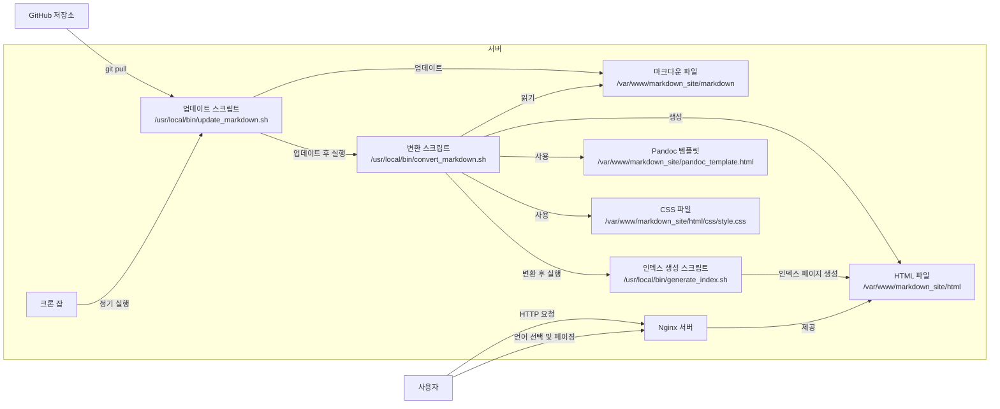

기존의 SSG 시스템을 확장하여 GitHub에서 데이터를 가져오고, 화면에 출력하며, 목록 관리 및 페이징 기능을 제공하는 방법을 설명해 드리겠습니다.

---

### **전체적인 목표**

- **데이터 가져오기**: GitHub 저장소에서 마크다운 파일을 가져옵니다.
- **화면 출력**: 마크다운 파일을 HTML로 변환하여 사용자에게 제공합니다.
- **목록 관리**: 게시물이나 페이지의 목록을 생성하고 표시합니다.
- **페이징 기능**: 많은 콘텐츠를 페이지별로 나누어 사용자 경험을 개선합니다.
- **언어 선택 및 폰트 적용**: 이전에 설정한 언어 선택 기능과 폰트 적용을 유지합니다.

---

### **구성 요소 및 구조**



---

### **1. 업데이트 스크립트 (`update_markdown.sh`)**

GitHub 저장소에서 마크다운 파일을 가져오는 부분은 기존과 동일합니다.

---

### **2. 변환 스크립트 (`convert_markdown.sh`) 수정**

마크다운 파일을 HTML로 변환하는 스크립트를 수정하여 메타데이터를 추출하고, 변환 후 인덱스 생성 스크립트를 실행하도록 합니다.

```bash
#!/bin/bash
INPUT_DIR="/var/www/markdown_site/markdown"
OUTPUT_DIR="/var/www/markdown_site/html"
CSS_FILE="/css/style.css"
TEMPLATE_FILE="/var/www/markdown_site/pandoc_template.html"
POSTS_DATA="/var/www/markdown_site/posts_data.txt"

# 기존 posts_data.txt 파일 삭제
rm -f "$POSTS_DATA"

mkdir -p "$OUTPUT_DIR"

find "$INPUT_DIR" -name "*.md" | while read -r file; do
    relative_path="${file#$INPUT_DIR/}"
    filename=$(basename "$file")
    filename_without_ext="${filename%.md}"
    lang_code="${filename_without_ext##*.}" # 파일명에서 언어 코드를 추출 (예: post-title.en.md)

    # 언어 코드를 추출할 수 없는 경우 기본 언어를 설정
    if [[ "$lang_code" != "en" && "$lang_code" != "ko" && "$lang_code" != "ja" ]]; then
        lang_code="en"
    fi

    output_file="$OUTPUT_DIR/${relative_path%.md}.html"
    output_dir=$(dirname "$output_file")
    mkdir -p "$output_dir"

    # 메타데이터 추출 (제목 및 날짜)
    title=$(grep '^# ' "$file" | head -n1 | sed 's/# //')
    date=$(grep '^Date: ' "$file" | head -n1 | sed 's/Date: //')

    # posts_data.txt에 게시물 정보 추가
    echo -e "${filename_without_ext}\t${title}\t${date}\t${lang_code}" >> "$POSTS_DATA"

    # Pandoc을 사용하여 HTML로 변환
    pandoc "$file" \
        -o "$output_file" \
        --standalone \
        --template="$TEMPLATE_FILE" \
        --metadata=lang:"$lang_code" \
        -c "$CSS_FILE" \
        --metadata title="$title"
done

# 변환 후 인덱스 생성 스크립트 실행
/usr/local/bin/generate_index.sh
```

**설명:**

- 각 마크다운 파일에서 제목과 날짜 메타데이터를 추출합니다.
  - 제목은 마크다운 파일의 첫 번째 레벨 1 헤더 (`# 제목`)로 가정합니다.
  - 날짜는 `Date: YYYY-MM-DD` 형식의 메타데이터로 가정합니다.
- 추출한 정보를 `posts_data.txt` 파일에 저장합니다.
- 변환 후 인덱스 생성 스크립트(`generate_index.sh`)를 실행합니다.

---

### **3. 인덱스 생성 스크립트 (`generate_index.sh`) 작성**

`posts_data.txt`를 기반으로 인덱스 페이지를 생성하고, 페이징 기능을 구현합니다.

```bash
#!/bin/bash
OUTPUT_DIR="/var/www/markdown_site/html"
POSTS_DATA="/var/www/markdown_site/posts_data.txt"
TEMPLATE_FILE="/var/www/markdown_site/index_template.html"
POSTS_PER_PAGE=5

# 언어 목록
LANGUAGES=("en" "ko" "ja")

for lang in "${LANGUAGES[@]}"; do
    # 해당 언어의 게시물 필터링
    grep -P "\t${lang}$" "$POSTS_DATA" | sort -k3 -r > "/tmp/posts_${lang}.txt"
    total_posts=$(cat "/tmp/posts_${lang}.txt" | wc -l)
    total_pages=$(( (total_posts + POSTS_PER_PAGE - 1) / POSTS_PER_PAGE ))

    for ((page=1; page<=total_pages; page++)); do
        start=$(( (page - 1) * POSTS_PER_PAGE + 1 ))
        end=$(( start + POSTS_PER_PAGE - 1 ))
        sed -n "${start},${end}p" "/tmp/posts_${lang}.txt" > "/tmp/posts_page_${lang}_${page}.txt"

        # 인덱스 페이지 생성
        output_file="${OUTPUT_DIR}/index${page}.${lang}.html"

        # 게시물 목록을 HTML로 변환
        posts_html=""
        while IFS=$'\t' read -r filename title date lang_code; do
            posts_html+="<li><a href=\"${filename}.${lang_code}.html\">${title}</a> - ${date}</li>"
        done < "/tmp/posts_page_${lang}_${page}.txt"

        # 페이징 네비게이션 생성
        pagination=""
        for ((i=1; i<=total_pages; i++)); do
            if [ $i -eq $page ]; then
                pagination+="<strong>${i}</strong> "
            else
                pagination+="<a href=\"index${i}.${lang}.html\">${i}</a> "
            fi
        done

        # 템플릿을 사용하여 인덱스 페이지 생성
        sed \
            -e "s|{{lang}}|${lang}|g" \
            -e "s|{{posts}}|${posts_html}|g" \
            -e "s|{{pagination}}|${pagination}|g" \
            "$TEMPLATE_FILE" > "$output_file"
    done
done
```

**설명:**

- 각 언어별로 게시물 목록을 생성하고, 날짜별로 내림차순 정렬합니다.
- 페이지당 게시물 수(`POSTS_PER_PAGE`)를 설정하고, 총 페이지 수를 계산합니다.
- 각 페이지마다 인덱스 페이지를 생성하고, 게시물 목록과 페이징 네비게이션을 포함합니다.
- 템플릿 파일(`index_template.html`)을 사용하여 인덱스 페이지를 생성합니다.

---

### **4. 인덱스 페이지 템플릿 (`index_template.html`) 작성**

인덱스 페이지의 HTML 구조를 정의합니다.

```html
<!DOCTYPE html>
<html lang="{{lang}}">
<head>
    <meta charset="UTF-8">
    <title>Your Site Title - Index</title>
    <link rel="stylesheet" href="/css/style.css">
</head>
<body>

<header>
    <div class="language-selector">
        <ul>
            <li><a href="index1.en.html">English</a></li>
            <li><a href="index1.ko.html">한국어</a></li>
            <li><a href="index1.ja.html">日本語</a></li>
        </ul>
    </div>
</header>

<div class="content">
    <h1>Your Site Title</h1>
    <ul>
        {{posts}}
    </ul>
    <div class="pagination">
        {{pagination}}
    </div>
</div>

</body>
</html>
```

**설명:**

- `{{lang}}`, `{{posts}}`, `{{pagination}}`은 인덱스 생성 스크립트에서 실제 값으로 대체됩니다.
- 언어 선택 메뉴는 첫 번째 인덱스 페이지(`index1.lang.html`)로 링크됩니다.

---

### **5. Pandoc 템플릿 (`pandoc_template.html`) 수정**

게시물 페이지에 이전 및 다음 게시물로 이동할 수 있는 네비게이션을 추가합니다.

```html
<!DOCTYPE html>
<html lang="$lang$">
<head>
    <meta charset="UTF-8">
    <title>$title$</title>
    <link rel="stylesheet" href="$css$">
</head>
<body>

<header>
    <div class="language-selector">
        <ul>
            <li><a href="index1.en.html">English</a></li>
            <li><a href="index1.ko.html">한국어</a></li>
            <li><a href="index1.ja.html">日本語</a></li>
        </ul>
    </div>
</header>

<div class="content">
    $body$
</div>

</body>
</html>
```

**설명:**

- 게시물 페이지에서는 네비게이션을 추가하지 않았지만, 필요하다면 이전 및 다음 게시물 링크를 생성할 수 있습니다.
- 이를 위해 추가적인 메타데이터와 스크립트 수정이 필요합니다.

---

### **6. CSS 파일 (`style.css`) 수정**

목록과 페이징 네비게이션에 대한 스타일을 추가합니다.

```css
/* /css/style.css */

/* 기존 스타일 생략 */

/* 게시물 목록 스타일 */
.content ul {
    list-style-type: none;
    padding: 0;
}

.content ul li {
    margin-bottom: 10px;
}

/* 페이징 네비게이션 스타일 */
.pagination {
    margin-top: 20px;
}

.pagination a {
    margin: 0 5px;
    text-decoration: none;
    color: #007bff;
}

.pagination a:hover {
    text-decoration: underline;
}

.pagination strong {
    margin: 0 5px;
    font-weight: bold;
}
```

---

### **7. 전체 동작 흐름**

1. **크론 잡 실행**: 정기적으로 `update_markdown.sh`를 실행합니다.
2. **마크다운 파일 업데이트**: GitHub 저장소에서 최신 마크다운 파일을 가져옵니다.
3. **마크다운 파일 변환**: `convert_markdown.sh`를 실행하여 마크다운 파일을 HTML로 변환하고, 게시물 메타데이터를 수집합니다.
4. **인덱스 페이지 생성**: `generate_index.sh`를 실행하여 언어별 인덱스 페이지를 생성하고, 페이징을 구현합니다.
5. **사용자 제공**: Nginx 서버를 통해 생성된 HTML 파일을 제공합니다.

---

### **8. Nginx 설정 확인**

Nginx 설정은 기존과 동일합니다. `/var/www/markdown_site/html` 디렉토리를 루트로 사용하며, 정적 파일을 제공합니다.

---

### **9. 추가 고려 사항**

- **마크다운 파일 구조**: 마크다운 파일은 다음과 같은 구조를 따릅니다.
  - 파일명: `post-title.en.md`, `post-title.ko.md`, `post-title.ja.md`
  - 내용 예시:
    ```markdown
    # 게시물 제목
    Date: 2023-10-15

    게시물 내용...
    ```
- **날짜 형식**: 날짜는 `YYYY-MM-DD` 형식을 사용합니다.
- **보안 및 권한 설정**: 스크립트와 웹 서버가 필요한 파일에 접근할 수 있도록 권한을 설정합니다.
- **에러 처리**: 스크립트 실행 중 발생하는 오류를 로그로 남겨 문제를 파악할 수 있도록 합니다.

---

### **10. 테스트 및 확인**

- 스크립트를 수동으로 실행하여 HTML 파일과 인덱스 페이지가 올바르게 생성되는지 확인합니다.
  ```bash
  /usr/local/bin/update_markdown.sh
  /usr/local/bin/convert_markdown.sh
  ```
- 브라우저에서 사이트에 접속하여 언어 선택, 게시물 목록, 페이징 기능이 정상적으로 동작하는지 확인합니다.

---

### **예시 파일 및 디렉토리 구조**

```
/var/www/markdown_site/
├── html/
│   ├── css/
│   │   └── style.css
│   ├── index1.en.html
│   ├── index1.ko.html
│   ├── index1.ja.html
│   ├── index2.en.html
│   ├── ...
│   ├── post-title.en.html
│   ├── post-title.ko.html
│   └── ...
├── markdown/
│   ├── post-title.en.md
│   ├── post-title.ko.md
│   └── ...
├── pandoc_template.html
├── index_template.html
├── posts_data.txt
├── update_markdown.sh
├── convert_markdown.sh
└── generate_index.sh
```

---

### **요약**

- **데이터 가져오기**: GitHub 저장소에서 마크다운 파일을 가져오는 스크립트를 유지합니다.
- **화면 출력**: Pandoc과 템플릿을 사용하여 마크다운 파일을 HTML로 변환합니다.
- **목록 관리 및 페이징**: 게시물 메타데이터를 수집하여 인덱스 페이지를 생성하고, 페이징 기능을 구현합니다.
- **언어 선택 및 폰트 적용**: 이전에 설정한 언어 선택 메뉴와 CSS를 사용하여 다국어 지원과 폰트 적용을 유지합니다.
- **스크립트 자동화**: 크론 잡을 통해 업데이트 및 변환 스크립트를 자동으로 실행하여 사이트를 최신 상태로 유지합니다.

---

### **추가 기능 구현 (선택 사항)**

- **검색 기능**: 사용자들이 게시물을 검색할 수 있도록 검색 기능을 추가할 수 있습니다. 이는 JavaScript를 사용하여 클라이언트 측에서 구현할 수 있습니다.
- **태그 및 카테고리**: 게시물에 태그나 카테고리를 추가하여 콘텐츠를 분류하고, 관련 게시물을 표시할 수 있습니다.
- **RSS 피드 생성**: 사이트의 RSS 피드를 생성하여 구독 기능을 제공할 수 있습니다.

---

### **마무리**

이렇게 하면 Hugo 없이도 GitHub에 있는 데이터를 가져와 화면에 출력하고, 목록 관리 및 페이징 기능을 제공하는 SSG 시스템을 구축할 수 있습니다. 스크립트와 템플릿을 적절히 수정하여 원하는 기능을 추가하거나 변경할 수 있습니다.
