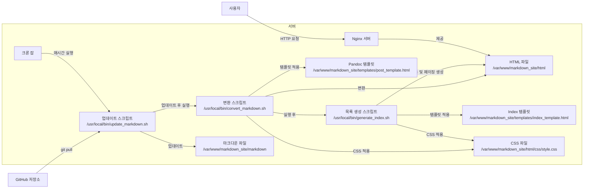

### **Rocky Linux 8 기반 정적 사이트 생성기(SSG) 시스템 구축**

이 문서는 GitHub에 저장된 마크다운 데이터를 가져와 HTML로 변환하고, 목록 관리 및 페이징 기능을 제공하는 **정적 사이트 생성기(SSG)** 시스템을 Rocky Linux 8 환경에서 구축하는 방법을 설명합니다. 이 시스템은 **Nginx**를 통해 웹 페이지를 제공합니다.

---

### **전체 시스템 구조 설명 (Mermaid 다이어그램)**

아래는 전체 시스템의 구조를 나타낸 Mermaid 다이어그램입니다.



---

### **시스템 구성 요소 설명**

1. **GitHub 저장소 (A)**: 마크다운 문서가 저장된 원격 저장소입니다.

2. **크론 잡 (D)**: 매시간 자동으로 실행되어, 업데이트 및 변환 스크립트를 수행합니다.

3. **업데이트 스크립트 (`update_markdown.sh`) (B)**: GitHub 저장소에서 최신 마크다운 파일을 가져와 로컬 디렉토리(`/var/www/markdown_site/markdown`)에 저장합니다.

4. **변환 스크립트 (`convert_markdown.sh`) (C)**: GitHub에서 가져온 마크다운 파일을 Pandoc 템플릿(`post_template.html`)과 CSS 파일(`style.css`)을 사용하여 HTML로 변환합니다.

5. **목록 생성 스크립트 (`generate_index.sh`) (G)**: 변환된 HTML 파일을 기반으로 인덱스 페이지와 페이징을 생성합니다.

6. **마크다운 파일 (E)**: 로컬에 저장된 마크다운 파일들로, 파일명에 언어 코드가 포함되어 있습니다 (예: `post.en.md`, `post.ko.md`, `post.ja.md`).

7. **HTML 파일 (F)**: 개별 포스트와 목록 페이지 HTML 파일입니다.

8. **템플릿 파일**:
   - **포스트 템플릿 (`post_template.html`) (T)**: 개별 포스트 HTML 구조를 정의합니다.
   - **인덱스 템플릿 (`index_template.html`) (I)**: 목록 페이지 HTML 구조를 정의합니다.

9. **CSS 파일 (S)**: `/var/www/markdown_site/html/css/style.css`에 위치하며, 폰트 및 스타일을 정의합니다.

10. **Nginx 서버 (GNG)**: 정적 HTML 파일을 사용자에게 제공합니다.

11. **사용자 (H)**: 웹 브라우저를 통해 사이트에 접속하여 콘텐츠를 열람합니다.

---

### **구체적인 단계별 설정 및 코드 작성**

#### **1. 디렉토리 구조 설정**

```bash
sudo mkdir -p /var/www/markdown_site/{markdown,html/css,templates}
sudo chown -R $USER:$USER /var/www/markdown_site
```

---

#### **2. 업데이트 스크립트 (`update_markdown.sh`) 작성**

```bash
sudo nano /usr/local/bin/update_markdown.sh
```

**내용:**

```bash
#!/bin/bash
cd /var/www/markdown_site/markdown
git pull origin main
```

**실행 권한 부여:**

```bash
sudo chmod +x /usr/local/bin/update_markdown.sh
```

---

#### **3. 변환 스크립트 (`convert_markdown.sh`) 작성**

```bash
sudo nano /usr/local/bin/convert_markdown.sh
```

**내용:**

```bash
#!/bin/bash
INPUT_DIR="/var/www/markdown_site/markdown"
OUTPUT_DIR="/var/www/markdown_site/html"
TEMPLATE="/var/www/markdown_site/templates/post_template.html"
CSS_FILE="/css/style.css"

mkdir -p "$OUTPUT_DIR"

find "$INPUT_DIR" -name "*.md" | while read -r file; do
    relative_path="${file#$INPUT_DIR/}"
    filename=$(basename "$file")
    filename_without_ext="${filename%.md}"
    lang_code="${filename_without_ext##*.}"

    # 언어 코드 검증
    if [[ "$lang_code" != "en" && "$lang_code" != "ko" && "$lang_code" != "ja" ]]; then
        lang_code="en" # 기본 언어 설정
    fi

    # 출력 파일 경로 설정
    output_file="$OUTPUT_DIR/${filename_without_ext%.*}.html"
    output_dir=$(dirname "$output_file")
    mkdir -p "$output_dir"

    # Pandoc을 사용하여 HTML 변환
    pandoc "$file" \
        --standalone \
        --template="$TEMPLATE" \
        --metadata=lang:"$lang_code" \
        -c "$CSS_FILE" \
        --metadata title="Your Site Title" \
        -o "$output_file"
done
```

**실행 권한 부여:**

```bash
sudo chmod +x /usr/local/bin/convert_markdown.sh
```

---

#### **4. 목록 생성 스크립트 (`generate_index.sh`) 작성**

```bash
sudo nano /usr/local/bin/generate_index.sh
```

**내용:**

```bash
#!/bin/bash
OUTPUT_DIR="/var/www/markdown_site/html"
TEMPLATE="/var/www/markdown_site/templates/index_template.html"
CSS_FILE="/css/style.css"
LANGUAGE="$1"
POSTS_PER_PAGE=5

posts=($(find "$OUTPUT_DIR" -name "*.$LANGUAGE.html" | sort))
total_posts=${#posts[@]}
total_pages=$(( (total_posts + POSTS_PER_PAGE - 1) / POSTS_PER_PAGE ))

for (( page=1; page<=total_pages; page++ )); do
    start=$(( (page - 1) * POSTS_PER_PAGE ))
    end=$(( start + POSTS_PER_PAGE ))
    current_posts=("${posts[@]:start:POSTS_PER_PAGE}")

    post_list=""
    for post in "${current_posts[@]}"; do
        title=$(grep -m1 "<title>" "$post" | sed -E 's/.*<title>(.*)<\/title>.*/\1/')
        link=$(echo "$post" | sed "s|$OUTPUT_DIR||")
        post_list+="<li><a href=\"${link}\">${title}</a></li>\n"
    done

    pagination=""
    if (( total_pages > 1 )); then
        pagination+="<div class=\"pagination\">\n"
        for (( p=1; p<=total_pages; p++ )); do
            if (( p == page )); then
                pagination+="<span>${p}</span> "
            else
                pagination+="<a href=\"index_${LANGUAGE}_page_${p}.html\">${p}</a> "
            fi
        done
        pagination+="\n</div>\n"
    fi

    index_file="$OUTPUT_DIR/index_${LANGUAGE}_page_${page}.html"
    echo "$(<$TEMPLATE)" | sed "s|{{POST_LIST}}|$post_list|g" | sed "s|{{PAGINATION}}|$pagination|g" | sed "s|{{LANG}}|$LANGUAGE|g" | sed "s|{{CSS}}|$CSS_FILE|g" > "$index_file"
done
```

**실행 권한 부여:**

```bash
sudo chmod +x /usr/local/bin/generate_index.sh
```

---

#### **5. 템플릿 파일 작성**

##### **5.1. 포스트 템플릿 (`post_template.html`) 작성**

```bash
sudo nano /var/www/markdown_site/templates/post_template.html
```

**내용:**

```html
<!DOCTYPE html>
<html lang="{{lang}}">
<head>
    <meta charset="UTF-8">
    <title>{{title}}</title>
    <link rel="stylesheet" href="{{css}}">
</head>
<body>
    <header>
        <div class="language-selector">
            <ul>
                <li><a href="index_en_page_1.html

">English</a></li>
                <li><a href="index_ko_page_1.html">한국어</a></li>
                <li><a href="index_ja_page_1.html">日本語</a></li>
            </ul>
        </div>
    </header>

    <div class="content">
        {{body}}
    </div>
</body>
</html>
```

---

##### **5.2. 인덱스 템플릿 (`index_template.html`) 작성**

```bash
sudo nano /var/www/markdown_site/templates/index_template.html
```

**내용:**

```html
<!DOCTYPE html>
<html lang="{{LANG}}">
<head>
    <meta charset="UTF-8">
    <title>Site Index - {{LANG}}</title>
    <link rel="stylesheet" href="{{CSS}}">
</head>
<body>
    <header>
        <div class="language-selector">
            <ul>
                <li><a href="index_en_page_1.html">English</a></li>
                <li><a href="index_ko_page_1.html">한국어</a></li>
                <li><a href="index_ja_page_1.html">日本語</a></li>
            </ul>
        </div>
    </header>

    <div class="content">
        <h1>Posts</h1>
        <ul>
            {{POST_LIST}}
        </ul>
        {{PAGINATION}}
    </div>
</body>
</html>
```

---

#### **6. CSS 파일 배치**

`style.css`를 `/var/www/markdown_site/html/css/` 디렉토리에 배치합니다.

```bash
mkdir -p /var/www/markdown_site/html/css
cp /path/to/your/style.css /var/www/markdown_site/html/css/
```

---

#### **7. 크론 잡 설정**

```bash
crontab -e
```

```bash
0 * * * * /usr/local/bin/update_markdown.sh && /usr/local/bin/convert_markdown.sh && /usr/local/bin/generate_index.sh en && /usr/local/bin/generate_index.sh ko && /usr/local/bin/generate_index.sh ja
```

---

#### **8. Nginx 설정 확인 및 재시작**

```bash
sudo nginx -t
sudo systemctl restart nginx
```

---

#### **9. 마크다운 파일 작성 규칙**

파일명에 언어 코드를 포함하여 `post.en.md`, `post.ko.md`, `post.ja.md` 형식으로 관리합니다.

---

### **시스템 연동 과정 요약**

1. **크론 잡 실행**: GitHub 데이터를 가져와 마크다운 파일을 HTML로 변환하고, 목록 및 페이징을 생성합니다.
2. **스크립트 실행 결과**: `/var/www/markdown_site/html/` 디렉토리에 HTML 파일이 생성됩니다.
3. **Nginx 서버 제공**: Nginx가 `/var/www/markdown_site/html`을 루트로 하여 웹 페이지를 제공합니다.

---

이 문서를 통해 GitHub에서 마크다운 데이터를 가져와 Rocky Linux 8 환경에서 정적 사이트 생성기를 구성할 수 있습니다.
