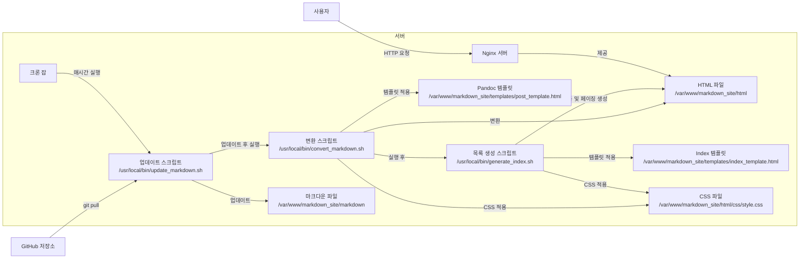

GitHub에 있는 마크다운 데이터를 가져와 화면에 출력하며, 목록 관리 및 페이징 기능을 제공하는 **정적 사이트 생성기(Static Site Generator, SSG)** 시스템을 구축하는 방법을 설명드리겠습니다. 이 시스템은 **Rocky Linux 8** 환경에서 작동하며, Nginx를 통해 웹 페이지를 제공합니다.

### **전체 시스템 구조 설명 (Mermaid 다이어그램)**

아래는 전체 시스템의 구조를 Mermaid 다이어그램으로 나타낸 것입니다.



### **시스템 구성 요소 설명**

1. **GitHub 저장소 (A):**
   - 마크다운 문서가 저장된 원격 저장소입니다.

2. **크론 잡 (D):**
   - 정해진 주기(예: 매시간)로 업데이트 및 변환 스크립트를 실행합니다.

3. **업데이트 스크립트 (`update_markdown.sh`) (B):**
   - GitHub 저장소에서 최신 마크다운 파일을 가져와 로컬 디렉토리(`/var/www/markdown_site/markdown`)에 업데이트합니다.

4. **변환 스크립트 (`convert_markdown.sh`) (C):**
   - 업데이트된 마크다운 파일을 HTML 파일로 변환합니다.
   - Pandoc 템플릿(`post_template.html`)과 CSS 파일(`style.css`)을 사용하여 변환합니다.

5. **목록 생성 스크립트 (`generate_index.sh`) (G):**
   - 변환된 HTML 파일을 기반으로 인덱스 페이지(목록)와 페이징을 생성합니다.
   - 인덱스 템플릿(`index_template.html`)과 CSS 파일(`style.css`)을 사용하여 목록 페이지를 생성합니다.

6. **마크다운 파일 (E):**
   - 로컬에 저장된 마크다운 파일들로, 파일명에 언어 코드가 포함되어 있습니다 (예: `post.en.md`, `post.ko.md`, `post.ja.md`).

7. **HTML 파일 (F):**
   - 변환된 개별 포스트 HTML 파일 및 목록 페이지 HTML 파일입니다.

8. **템플릿 파일:**
   - **포스트 템플릿 (`post_template.html`) (T):** 개별 포스트 HTML 구조를 정의합니다.
   - **인덱스 템플릿 (`index_template.html`) (I):** 목록 페이지 HTML 구조를 정의합니다.

9. **CSS 파일 (S):**
   - `/var/www/markdown_site/html/css/style.css`에 위치하며, 폰트 및 스타일을 정의합니다.

10. **Nginx 서버 (GNG):**
    - 정적 HTML 파일을 사용자에게 제공합니다.

11. **사용자 (H):**
    - 웹 브라우저를 통해 사이트에 접속하여 콘텐츠를 열람합니다.

### **구체적인 단계별 설정 및 코드 작성**

#### **1. 디렉토리 구조 설정**

```bash
sudo mkdir -p /var/www/markdown_site/{markdown,html/css,templates}
sudo chown -R $USER:$USER /var/www/markdown_site
```

#### **2. 업데이트 스크립트 (`update_markdown.sh`) 작성**

```bash
sudo nano /usr/local/bin/update_markdown.sh
```

**내용:**

```bash
#!/bin/bash
cd /var/www/markdown_site/markdown
git pull origin main
```

**실행 권한 부여:**

```bash
sudo chmod +x /usr/local/bin/update_markdown.sh
```

#### **3. 변환 스크립트 (`convert_markdown.sh`) 작성**

```bash
sudo nano /usr/local/bin/convert_markdown.sh
```

**내용:**

```bash
#!/bin/bash
INPUT_DIR="/var/www/markdown_site/markdown"
OUTPUT_DIR="/var/www/markdown_site/html"
TEMPLATE="/var/www/markdown_site/templates/post_template.html"
CSS_FILE="/css/style.css"

mkdir -p "$OUTPUT_DIR"

find "$INPUT_DIR" -name "*.md" | while read -r file; do
    relative_path="${file#$INPUT_DIR/}"
    filename=$(basename "$file")
    filename_without_ext="${filename%.md}"
    lang_code="${filename_without_ext##*.}" # 예: post.en -> en

    # 언어 코드 검증
    if [[ "$lang_code" != "en" && "$lang_code" != "ko" && "$lang_code" != "ja" ]]; then
        lang_code="en" # 기본 언어 설정
    fi

    # 출력 파일 경로 설정
    output_file="$OUTPUT_DIR/${filename_without_ext%.*}.html"
    output_dir=$(dirname "$output_file")
    mkdir -p "$output_dir"

    # Pandoc을 사용하여 HTML 변환
    pandoc "$file" \
        --standalone \
        --template="$TEMPLATE" \
        --metadata=lang:"$lang_code" \
        -c "$CSS_FILE" \
        --metadata title="Your Site Title" \
        -o "$output_file"
done
```

**실행 권한 부여:**

```bash
sudo chmod +x /usr/local/bin/convert_markdown.sh
```

#### **4. 목록 생성 스크립트 (`generate_index.sh`) 작성**

```bash
sudo nano /usr/local/bin/generate_index.sh
```

**내용:**

```bash
#!/bin/bash
OUTPUT_DIR="/var/www/markdown_site/html"
TEMPLATE="/var/www/markdown_site/templates/index_template.html"
CSS_FILE="/css/style.css"
LANGUAGE="$1" # 언어 코드 (en, ko, ja)
POSTS_PER_PAGE=5

# 포스트 목록 추출
posts=($(find "$OUTPUT_DIR" -name "*.$LANGUAGE.html" | sort))

total_posts=${#posts[@]}
total_pages=$(( (total_posts + POSTS_PER_PAGE - 1) / POSTS_PER_PAGE ))

for (( page=1; page<=total_pages; page++ )); do
    start=$(( (page - 1) * POSTS_PER_PAGE ))
    end=$(( start + POSTS_PER_PAGE ))
    current_posts=("${posts[@]:start:POSTS_PER_PAGE}")

    # HTML 리스트 생성
    post_list=""
    for post in "${current_posts[@]}"; do
        title=$(grep -m1 "<title>" "$post" | sed -E 's/.*<title>(.*)<\/title>.*/\1/')
        link=$(echo "$post" | sed "s|$OUTPUT_DIR||")
        post_list+="<li><a href=\"${link}\">${title}</a></li>\n"
    done

    # 페이징 네비게이션 생성
    pagination=""
    if (( total_pages > 1 )); then
        pagination+="<div class=\"pagination\">\n"
        for (( p=1; p<=total_pages; p++ )); do
            if (( p == page )); then
                pagination+="<span>${p}</span> "
            else
                pagination+="<a href=\"index_${LANGUAGE}_page_${p}.html\">${p}</a> "
            fi
        done
        pagination+="\n</div>\n"
    fi

    # 템플릿 적용
    index_file="$OUTPUT_DIR/index_${LANGUAGE}_page_${page}.html"
    echo "$(<$TEMPLATE)" | sed "s|{{POST_LIST}}|$post_list|g" | sed "s|{{PAGINATION}}|$pagination|g" | sed "s|{{LANG}}|$LANGUAGE|g" | sed "s|{{CSS}}|$CSS_FILE|g" > "$index_file"
done
```

**실행 권한 부여:**

```bash
sudo chmod +x /usr/local/bin/generate_index.sh
```

#### **5. 템플릿 파일 작성**

##### **5.1. 포스트 템플릿 (`post_template.html`) 작성**

```bash
sudo nano /var/www/markdown_site/templates/post_template.html
```

**내용:**

```html
<!DOCTYPE html>
<html lang="{{lang}}">
<head>
    <meta charset="UTF-8">
    <title>{{title}}</title>
    <link rel="stylesheet" href="{{css}}">
</head>
<body>
    <header>
        <div class="language-selector">
            <ul>
                <li><a href="index_en_page_1.html">English</a></li>
                <li><a href="index_ko_page_1.html">한국어</a></li>
                <li><a href="index_ja_page_1.html">日本語</a></li>
            </ul>
        </div>
    </header>

    <div class="content">
        {{body}}
    </div>
</body>
</html>
```

##### **5.2. 인덱스 템플릿 (`index_template.html`) 작성**

```bash
sudo nano /var/www/markdown_site/templates/index_template.html
```

**내용:**

```html
<!DOCTYPE html>
<html lang="{{LANG}}">
<head>
    <meta charset="UTF-8">
    <title>Site Index - {{LANG}}</title>
    <link rel="stylesheet" href="{{CSS}}">
</head>
<body>
    <header>
        <div class="language-selector">
            <ul>
                <li><a href="index_en_page_1.html">English</a></li>
                <li><a href="index_ko_page_1.html">한국어</a></li>
                <li><a href="index_ja_page_1.html">日本語</a></li>
            </ul>
        </div>
    </header>

    <div class="content">
        <h1>Posts</h1>
        <ul>
            {{POST_LIST}}
        </ul>
        {{PAGINATION}}
    </div>
</body>
</html>
```

#### **6. CSS 파일 배치**

이미 작성한 `/css/style.css` 파일을 `/var/www/markdown_site/html/css/` 디렉토리에 복사합니다.

```bash
mkdir -p /var/www/markdown_site/html/css
cp /path/to/your/style.css /var/www/markdown_site/html/css/
```

**참고:** `/path/to/your/style.css`는 실제 CSS 파일의 경로로 대체하세요.

#### **7. 크론 잡 설정**

크론 잡을 설정하여 정기적으로 업데이트, 변환, 목록 생성을 자동으로 실행합니다.

```bash
crontab -e
```

다음 라인을 추가하여 매시간마다 스크립트를 실행합니다.

```
0 * * * * /usr/local/bin/update_markdown.sh && /usr/local/bin/convert_markdown.sh && /usr/local/bin/generate_index.sh en && /usr/local/bin/generate_index.sh ko && /usr/local/bin/generate_index.sh ja
```

**설명:**

- `update_markdown.sh`: GitHub에서 최신 마크다운 파일을 가져옵니다.
- `convert_markdown.sh`: 마크다운 파일을 HTML로 변환합니다.
- `generate_index.sh en`: 영어 포스트 목록과 페이징을 생성합니다.
- `generate_index.sh ko`: 한국어 포스트 목록과 페이징을 생성합니다.
- `generate_index.sh ja`: 일본어 포스트 목록과 페이징을 생성합니다.

#### **8. Nginx 설정 확인 및 재시작**

이미 Nginx가 설치 및 설정되어 있다고 가정합니다. 설정 파일(`/etc/nginx/conf.d/markdown_site.conf`)이 올바르게 설정되어 있는지 확인하고, Nginx를 재시작합니다.

```bash
sudo nginx -t
sudo systemctl restart nginx
```

#### **9. 마크다운 파일 작성 규칙**

마크다운 파일은 언어 코드를 파일명에 포함시켜야 합니다. 예를 들어:

- `post.en.md` (영어)
- `post.ko.md` (한국어)
- `post.ja.md` (일본어)

이를 통해 변환 스크립트가 언어 코드를 추출하여 적절한 HTML 파일을 생성할 수 있습니다.

#### **10. 시스템 테스트**

1. **수동으로 스크립트 실행:**

   ```bash
   /usr/local/bin/update_markdown.sh
   /usr/local/bin/convert_markdown.sh
   /usr/local/bin/generate_index.sh en
   /usr/local/bin/generate_index.sh ko
   /usr/local/bin/generate_index.sh ja
   ```

2. **웹 브라우저에서 확인:**
   - 영어 목록: `http://your_domain_or_IP/index_en_page_1.html`
   - 한국어 목록: `http://your_domain_or_IP/index_ko_page_1.html`
   - 일본어 목록: `http://your_domain_or_IP/index_ja_page_1.html`

   각 언어별로 목록과 페이징이 올바르게 작동하는지 확인합니다.

### **추가 구성 요소 및 기능 설명**

#### **1. 페이징 기능**

`generate_index.sh` 스크립트는 `POSTS_PER_PAGE` 변수로 한 페이지당 표시할 포스트 수를 설정합니다. 이 스크립트는 각 언어별로 여러 개의 인덱스 페이지(`index_en_page_1.html`, `index_en_page_2.html`, ...)를 생성하여 페이징을 구현합니다.

#### **2. 언어 선택 메뉴**

각 HTML 템플릿에는 언어 선택 메뉴가 포함되어 있습니다. 사용자는 메뉴를 통해 원하는 언어의 인덱스 페이지로 이동할 수 있습니다.

#### **3. SEO 및 메타데이터**

템플릿 파일(`post_template.html` 및 `index_template.html`)에 메타데이터를 추가하여 SEO를 개선할 수 있습니다.

**예시:**

```html
<meta name="description" content="Description of the page">
<meta name="keywords" content="keyword1, keyword2, keyword3">
<meta name="author" content="Your Name">
```

#### **4. 반응형 디자인 및 접근성**

CSS 파일(`style.css`)에 반응형 디자인을 위한 미디어 쿼리와 접근성을 고려한 스타일을 추가하여 다양한 기기에서 최적의 사용자 경험을 제공할 수 있습니다.

**예시:**

```css
/* 반응형 디자인 */
@media (max-width: 768px) {
    .content {
        padding: 10px;
    }
    header nav ul {
        flex-direction: column;
        align-items: flex-start;
    }
}

/* 접근성 향상 */
a:focus, a:hover {
    outline: 2px solid #0056b3;
}
```

#### **5. 보안 및 권한 설정**

- **파일 권한:**
  - 웹 서버(Nginx)가 `/var/www/markdown_site/html` 디렉토리에 접근할 수 있도록 권한을 설정합니다.
  - 스크립트가 필요한 디렉토리에 쓸 수 있도록 권한을 조정합니다.

  ```bash
  sudo chown -R nginx:nginx /var/www/markdown_site/html
  sudo chmod -R 755 /var/www/markdown_site/html
  ```

- **GitHub 인증:**
  - 비공개 저장소를 사용하는 경우, GitHub 액세스 토큰을 사용하여 인증을 설정해야 합니다.
  - `update_markdown.sh` 스크립트에서 SSH 키 또는 HTTPS 인증을 구성합니다.

#### **6. 로그 관리**

스크립트 실행 시 로그를 남겨 문제 발생 시 원인을 파악할 수 있도록 합니다.

**예시: `update_markdown.sh` 수정:**

```bash
#!/bin/bash
LOG_FILE="/var/log/markdown_site/update_markdown.log"
cd /var/www/markdown_site/markdown
git pull origin main >> "$LOG_FILE" 2>&1
```

비슷하게 다른 스크립트들도 로그 파일을 지정하여 기록할 수 있습니다.

#### **7. 자동화 개선**

실시간으로 파일 변경을 감지하여 변환할 수 있지만, 시스템 리소스를 고려하여 크론 잡을 사용하는 것이 권장됩니다. 그러나 필요에 따라 `inotify-tools`를 사용하여 실시간 변환을 설정할 수 있습니다.

### **/css/style.css 전체 내용**

이미 제공된 내용을 기반으로, 다국어 지원과 기본 스타일을 포함한 `style.css` 파일의 전체 내용을 다시 정리합니다.

```css
/* /css/style.css */

/* UTF-8 인코딩은 HTML 파일에 <meta charset="UTF-8">로 설정 */

/* 폰트 임포트 */

/* 영문 폰트: Roboto */
@import url('https://fonts.googleapis.com/css2?family=Roboto&display=swap');

/* 한글 폰트: Noto Sans KR */
@import url('https://fonts.googleapis.com/css2?family=Noto+Sans+KR&display=swap');

/* 일문 폰트: Noto Sans JP */
@import url('https://fonts.googleapis.com/css2?family=Noto+Sans+JP&display=swap');

/* 언어별 폰트 적용 */
html[lang="en"] body {
  font-family: 'Roboto', sans-serif;
}

html[lang="ko"] body {
  font-family: 'Noto Sans KR', sans-serif;
}

html[lang="ja"] body {
  font-family: 'Noto Sans JP', sans-serif;
}

/* 기본 스타일 */
body {
  font-size: 16px;
  line-height: 1.6;
  margin: 0;
  padding: 0;
}

/* 헤더 스타일 */
header {
  background-color: #f8f9fa;
  padding: 10px;
}

header nav ul {
  list-style-type: none;
  display: flex;
  gap: 10px;
}

header nav ul li {
  display: inline;
}

header nav ul li a {
  text-decoration: none;
  color: #007bff;
}

header nav ul li a:hover {
  text-decoration: underline;
}

/* 언어 선택 메뉴 스타일 */
.language-selector {
  text-align: right;
  margin: 10px;
}

.language-selector ul {
  list-style-type: none;
  margin: 0;
  padding: 0;
}

.language-selector ul li {
  display: inline;
  margin-left: 10px;
}

.language-selector ul li a {
  text-decoration: none;
  color: #007bff;
}

.language-selector ul li a:hover {
  text-decoration: underline;
}

/* 콘텐츠 스타일 */
.content {
  max-width: 800px;
  margin: 20px auto;
  padding: 20px;
}

/* 게시물 목록 스타일 */
.content ul {
  list-style-type: none;
  padding: 0;
}

.content ul li {
  margin-bottom: 10px;
}

.content ul li a {
  text-decoration: none;
  color: #333;
}

.content ul li a:hover {
  text-decoration: underline;
}

/* 페이징 스타일 */
.pagination {
  text-align: center;
  margin-top: 20px;
}

.pagination a, .pagination span {
  display: inline-block;
  margin: 0 5px;
  padding: 8px 12px;
  text-decoration: none;
  color: #007bff;
  border: 1px solid #ddd;
  border-radius: 4px;
}

.pagination a:hover {
  background-color: #f1f1f1;
}

.pagination span {
  background-color: #007bff;
  color: white;
  border-color: #007bff;
}
```

### **시스템 연동 과정 요약**

1. **크론 잡 실행:**
   - `update_markdown.sh`가 GitHub 저장소에서 최신 마크다운 파일을 가져옵니다.
   - `convert_markdown.sh`가 마크다운 파일을 HTML 파일로 변환합니다.
   - `generate_index.sh`가 각 언어별로 목록 및 페이징을 생성합니다.

2. **스크립트 실행 결과:**
   - `/var/www/markdown_site/html/` 디렉토리에 개별 포스트 HTML 파일과 언어별 인덱스 페이지 HTML 파일이 생성됩니다.
   - `/var/www/markdown_site/html/css/style.css`에 스타일이 적용됩니다.

3. **Nginx 서버 제공:**
   - Nginx는 `/var/www/markdown_site/html` 디렉토리를 루트로 설정하여 사용자에게 정적 HTML 파일을 제공합니다.

4. **사용자 경험:**
   - 사용자가 웹 브라우저를 통해 사이트에 접속하면, Nginx가 최신 HTML 파일을 제공합니다.
   - 언어 선택 메뉴를 통해 사용자는 원하는 언어의 인덱스 페이지로 이동할 수 있습니다.
   - 인덱스 페이지에서는 포스트 목록과 페이징을 통해 콘텐츠를 쉽게 탐색할 수 있습니다.

### **추가 고려 사항**

#### **1. 다국어 콘텐츠 관리**

- 각 언어별로 마크다운 파일을 관리하여 콘텐츠를 분리할 수 있습니다.
- 파일명에 언어 코드를 포함시켜 변환 스크립트가 올바르게 언어를 설정하도록 합니다.

#### **2. 템플릿 확장**

- 필요에 따라 템플릿 파일(`post_template.html` 및 `index_template.html`)을 확장하여 더 다양한 기능(예: 사이드바, 푸터, 메타데이터 등)을 추가할 수 있습니다.

#### **3. 검색 기능 추가**

- 정적 사이트에서는 JavaScript 기반의 클라이언트 사이드 검색 기능을 추가하여 사용자들이 콘텐츠를 검색할 수 있도록 할 수 있습니다.

#### **4. 배포 자동화**

- 사이트 빌드 후 자동으로 Nginx에 배포되도록 스크립트를 추가할 수 있습니다.
- 예를 들어, 빌드가 완료된 후 Nginx를 재시작하거나 캐시를 새로고침하도록 설정할 수 있습니다.

#### **5. 보안 강화**

- Nginx 설정을 통해 보안 헤더를 추가하고, 불필요한 파일 접근을 차단하여 보안을 강화합니다.
- HTTPS를 설정하여 사이트의 보안을 향상시킵니다.

### **예시 HTML 파일 생성**

#### **포스트 HTML 파일 예시 (`post.en.html`)**

```html
<!DOCTYPE html>
<html lang="en">
<head>
    <meta charset="UTF-8">
    <title>My First Post</title>
    <link rel="stylesheet" href="/css/style.css">
</head>
<body>
    <header>
        <div class="language-selector">
            <ul>
                <li><a href="index_en_page_1.html">English</a></li>
                <li><a href="index_ko_page_1.html">한국어</a></li>
                <li><a href="index_ja_page_1.html">日本語</a></li>
            </ul>
        </div>
    </header>

    <div class="content">
        <h1>My First Post</h1>
        <p>Welcome to my first post written in English.</p>
    </div>
</body>
</html>
```

#### **인덱스 HTML 파일 예시 (`index_en_page_1.html`)**

```html
<!DOCTYPE html>
<html lang="en">
<head>
    <meta charset="UTF-8">
    <title>Site Index - en</title>
    <link rel="stylesheet" href="/css/style.css">
</head>
<body>
    <header>
        <div class="language-selector">
            <ul>
                <li><a href="index_en_page_1.html">English</a></li>
                <li><a href="index_ko_page_1.html">한국어</a></li>
                <li><a href="index_ja_page_1.html">日本語</a></li>
            </ul>
        </div>
    </header>

    <div class="content">
        <h1>Posts</h1>
        <ul>
            <li><a href="post.en.html">My First Post</a></li>
            <!-- 추가 포스트 목록 -->
        </ul>
        <div class="pagination">
            <span>1</span>
            <a href="index_en_page_2.html">2</a>
            <!-- 추가 페이지 링크 -->
        </div>
    </div>
</body>
</html>
```

### **마무리**

이렇게 설정하시면, **Rocky Linux 8** 환경에서 GitHub에 있는 마크다운 문서를 자동으로 가져와 HTML로 변환하고, 목록 및 페이징 기능을 제공하는 간단한 정적 사이트 생성기 시스템을 구축할 수 있습니다. 이 시스템은 복잡한 환경 없이도 필요한 기능을 모두 갖추고 있으며, Nginx를 통해 효율적으로 웹 페이지를 제공할 수 있습니다.
